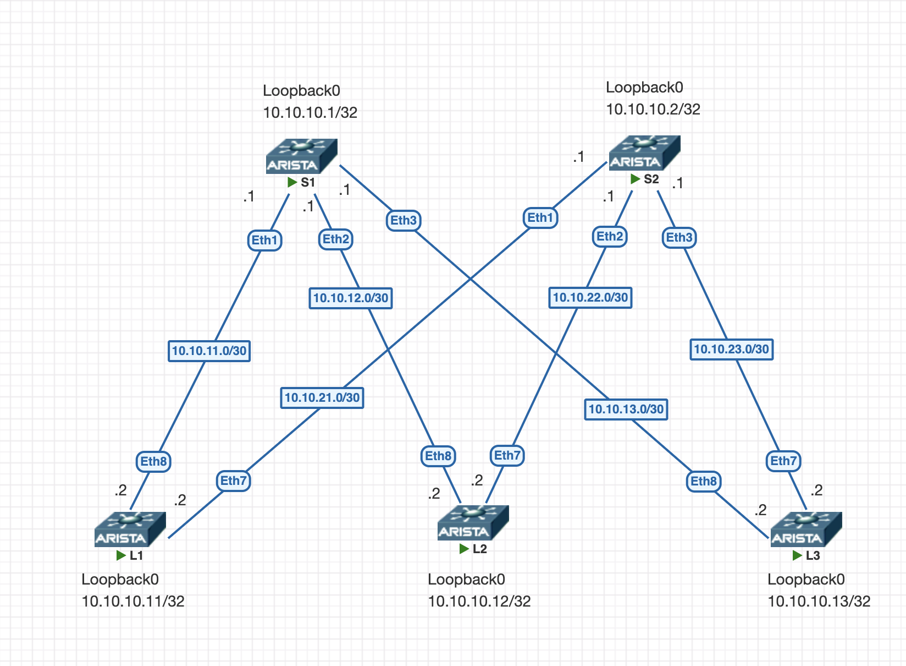

# OSPF Underlay (Spine–Leaf)

## Цель

Настроить протокол динамической маршрутизации OSPF в качестве underlay-сети для топологии Spine–Leaf (2 Spine + 3 Leaf).

Цель:
- обеспечить доступность всех loopback-интерфейсов
- обеспечить доступность всех underlay-сетей
- убедиться, что маршруты распространяются через OSPF

---

## Схема



---

## 🌐 Адресация

Логика адресации и коммутация представлены [здесь](https://github.com/bersenevns/home_work_otus/blob/main/hw1/README.md). Добавлены только loopback.

### Loopback-интерфейсы

| Устройство | Loopback0      |
|------------|----------------|
| S1         | 10.10.10.1/32  |
| S2         | 10.10.10.2/32  |
| L1         | 10.10.10.11/32 |
| L2         | 10.10.10.12/32 |
| L3         | 10.10.10.13/32 |

---

## ⚙️ Конфигурация

1) Включен роутинг
2) На интерфейсах настроен MTU 9214
3) Настроен router-id
4) По умолчанию все интерфейсы в OSPF являются пассивными
5) Network-type Point-to-point

Конфигурация устройст представлена ниже, лишние строки удалены в целях читаемости.

<details>
<summary>Показать конфигурацию S1</summary>

```bash
hostname S1
!
interface Ethernet1
   description TO_LEAF_1
   mtu 9214
   no switchport
   ip address 10.10.11.1/30
   ip ospf network point-to-point
   ip ospf area 0.0.0.0
!
interface Ethernet2
   description TO_LEAF_2
   mtu 9214
   no switchport
   ip address 10.10.12.1/30
   ip ospf network point-to-point
   ip ospf area 0.0.0.0
!
interface Ethernet3
   description TO_LEAF_3
   mtu 9214
   no switchport
   ip address 10.10.13.1/30
   ip ospf network point-to-point
   ip ospf area 0.0.0.0
!
interface Loopback0
   ip address 10.10.10.1/32
   ip ospf area 0.0.0.0
!
ip routing
!
router ospf 1
   router-id 10.10.10.1
   passive-interface default
   no passive-interface Ethernet1
   no passive-interface Ethernet2
   no passive-interface Ethernet3
   max-lsa 12000
!
end
```
</details>

<details>
<summary>Показать конфигурацию S2</summary>
```bash
hostname S2
!
interface Ethernet1
   description TO_LEAF_1
   mtu 9214
   no switchport
   ip address 10.10.21.1/30
   ip ospf network point-to-point
   ip ospf area 0.0.0.0
!
interface Ethernet2
   description TO_LEAF_2
   mtu 9214
   no switchport
   ip address 10.10.22.1/30
   ip ospf network point-to-point
   ip ospf area 0.0.0.0
!
interface Ethernet3
   description TO_LEAF_3
   mtu 9214
   no switchport
   ip address 10.10.23.1/30
   ip ospf network point-to-point
   ip ospf area 0.0.0.0
!
interface Loopback0
   ip address 10.10.10.2/32
   ip ospf area 0.0.0.0
!
ip routing
!
router ospf 1
   router-id 10.10.10.2
   passive-interface default
   no passive-interface Ethernet1
   no passive-interface Ethernet2
   no passive-interface Ethernet3
   max-lsa 12000
!
end
```
</details>

<details>
<summary>Показать конфигурацию L1</summary>

```bash
hostname L1
!
interface Ethernet7
   description TO_SPINE_2
   mtu 9214
   no switchport
   ip address 10.10.21.2/30
   ip ospf network point-to-point
   ip ospf area 0.0.0.0
!
interface Ethernet8
   description TO_SPINE_1
   mtu 9214
   no switchport
   ip address 10.10.11.2/30
   ip ospf network point-to-point
   ip ospf area 0.0.0.0
!
interface Loopback0
   ip address 10.10.10.11/32
   ip ospf area 0.0.0.0
!
interface Management1
!
ip routing
!
router ospf 1
   router-id 10.10.10.3
   passive-interface default
   no passive-interface Ethernet7
   no passive-interface Ethernet8
   max-lsa 12000
!
end
```
</details>

<details>
<summary>Показать конфигурацию L2</summary>

```bash
hostname L2
!
interface Ethernet7
   description TO_SPINE_2
   mtu 9214
   no switchport
   ip address 10.10.22.2/30
   ip ospf network point-to-point
   ip ospf area 0.0.0.0
!
interface Ethernet8
   description TO_SPINE_1
   mtu 9214
   no switchport
   ip address 10.10.12.2/30
   ip ospf network point-to-point
   ip ospf area 0.0.0.0
!
interface Loopback0
   ip address 10.10.10.12/32
   ip ospf area 0.0.0.0
!
interface Management1
!
ip routing
!
router ospf 1
   router-id 10.10.10.4
   passive-interface default
   no passive-interface Ethernet7
   no passive-interface Ethernet8
   max-lsa 12000
!
end
```
</details>

<details>
<summary>Показать конфигурацию L3</summary>

```bash
hostname L3
!
interface Ethernet7
   description TO_SPINE_2
   mtu 9214
   no switchport
   ip address 10.10.23.2/30
   ip ospf network point-to-point
   ip ospf area 0.0.0.0
!
interface Ethernet8
   description TO_SPINE_1
   mtu 9214
   no switchport
   ip address 10.10.13.2/30
   ip ospf network point-to-point
   ip ospf area 0.0.0.0
!
interface Ethernet9
!
interface Loopback0
   ip address 10.10.10.13/32
   ip ospf area 0.0.0.0
!
interface Management1
!
ip routing
!
router ospf 1
   router-id 10.10.10.5
   passive-interface default
   no passive-interface Ethernet7
   no passive-interface Ethernet8
   max-lsa 12000
!
end
```
</details>
