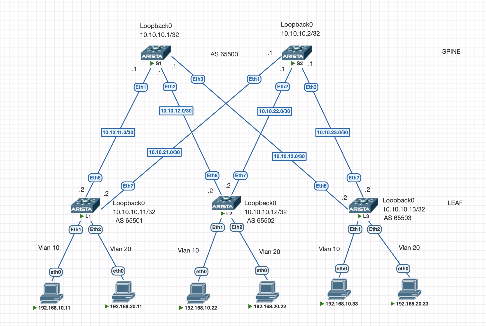

# VXLAN L2VNI

## Цель

Обеспечить L2 связанность между хостами по L3 сети в топологии Spine–Leaf (2 Spine + 3 Leaf).

Для этого:
- настроить BGP peering между Leaf и Spine в AF L2 evpn.
- хосты в одном VLAN, но на разных Leaf должны пинговать друг друга.

---

## Схема

Протокол динамической маршрутизации BGP будет использоваться и в качестве underlay (eBGP), и в качестве overlay (AF evpn), чтобы избежать избыточной конфигурации. Подробнее о настройке eBGP underlay [здесь](https://github.com/bersenevns/home_work_otus/blob/main/hw4/README.md).

К каждому Leaf подключено по 2 хоста:
- хост в VLAN 10 (eth1) попадет в VNI 1010
- хост в VLAN 20 (eth2) попадет в VNI 2020



---

## Адресация

Логика адресации и коммутация представлены [здесь](https://github.com/bersenevns/home_work_otus/blob/main/hw1/README.md). Ниже представлена краткая выжимка.

### Spine 1 connections

| Link    | Network       | Spine Port | Spine IP   | Leaf IP    | Leaf Port |
|---------|---------------|------------|------------|------------|-----------|
| S1 ↔ L1 | 10.10.11.0/30 | eth1       | 10.10.11.1 | 10.10.11.2 | eth8      |
| S1 ↔ L2 | 10.10.12.0/30 | eth2       | 10.10.12.1 | 10.10.12.2 | eth8      |
| S1 ↔ L3 | 10.10.13.0/30 | eth3       | 10.10.13.1 | 10.10.13.2 | eth8      |

---

### Spine 2 connections

| Link    | Network       | Spine Port | Spine IP   | Leaf IP    | Leaf Port |
|---------|---------------|------------|------------|------------|-----------|
| S2 ↔ L1 | 10.10.21.0/30 | eth1       | 10.10.21.1 | 10.10.21.2 | eth7      |
| S2 ↔ L2 | 10.10.22.0/30 | eth2       | 10.10.22.1 | 10.10.22.2 | eth7      |
| S2 ↔ L3 | 10.10.23.0/30 | eth3       | 10.10.23.1 | 10.10.23.2 | eth7      |

---

### Loopback-интерфейсы

| Устройство | Loopback0      |
|------------|----------------|
| S1         | 10.10.10.1/32  |
| S2         | 10.10.10.2/32  |
| L1         | 10.10.10.11/32 |
| L2         | 10.10.10.12/32 |
| L3         | 10.10.10.13/32 |

### AS-numbering

| Устройство | ASN   |
|------------|-------|
| S1         | 65500 |
| S2         | 65500 |
| L1         | 65501 |
| L2         | 65502 |
| L3         | 65503 |

### Адресация хостов

| Устройство | интерфейс | VLAN | IP            |
|------------|-----------|------|---------------|
| Leaf1      | eth1      | 10   | 192.168.10.11 |
| Leaf1      | eth2      | 20   | 192.168.20.11 |
| Leaf2      | eth1      | 10   | 192.168.10.22 |
| Leaf2      | eth2      | 20   | 192.168.20.22 |
| Leaf3      | eth1      | 10   | 192.168.10.33 |
| Leaf3      | eth2      | 20   | 192.168.20.33 |

---

## Конфигурация

1) Включен роутинг
2) На интерфейсах настроен MTU 9214
3) Настроен router-id
4) Настроен BFD
5) Измменены таймеры BGP 3s keep-alive, 9s hold
6) Настроена аутентификация для BGP
7) Настроен ECMP
8) Конфигурация с использованием peer group для удобства
9) Включена модель multi-agent для возможности использования MP-BGP
10) mapping VLAN - VNI
11) Использование vlan-aware-bundle, чтобы работать не с одним, а сразу с несколькими VLAN
12) redistribute изученных локально mac-адресов
13) Включение отправки extended community (без этого не заработает)

Конфигурация устройств представлена ниже, лишние строки удалены в целях читаемости.

<details>
<summary><b>Показать конфигурацию S1</b></summary>

```bash
service routing protocols model multi-agent
!
hostname S1
!
interface Ethernet1
   mtu 9214
   no switchport
   ip address 10.10.11.1/30
!
interface Ethernet2
   mtu 9214
   no switchport
   ip address 10.10.12.1/30
!
interface Ethernet3
   mtu 9214
   no switchport
   ip address 10.10.13.1/30
interface Loopback0
   ip address 10.10.10.1/32
!
ip routing
!
router bgp 65500
   router-id 10.10.10.1
   timers bgp 3 9
   maximum-paths 10 ecmp 10
   neighbor LEAFS peer group
   neighbor LEAFS bfd
   neighbor LEAFS password 7 /3ZkUd1QPGBJ7Vztltm37A==
   neighbor LEAFS send-community extended
   neighbor 10.10.11.2 peer group LEAFS
   neighbor 10.10.11.2 remote-as 65501
   neighbor 10.10.11.2 description L1
   neighbor 10.10.12.2 peer group LEAFS
   neighbor 10.10.12.2 remote-as 65502
   neighbor 10.10.12.2 description L2
   neighbor 10.10.13.2 peer group LEAFS
   neighbor 10.10.13.2 remote-as 65503
   neighbor 10.10.13.2 description L3
   !
   address-family evpn
      neighbor LEAFS activate
      neighbor LEAFS encapsulation vxlan
   !
   address-family ipv4
      neighbor LEAFS activate
      network 10.10.10.1/32
!
end
```
</details>

<details>
<summary><b>Показать конфигурацию S2</b></summary>

```bash
service routing protocols model multi-agent
!
hostname S2
!
interface Ethernet1
   mtu 9214
   no switchport
   ip address 10.10.21.1/30
!
interface Ethernet2
   mtu 9214
   no switchport
   ip address 10.10.22.1/30
!
interface Ethernet3
   mtu 9214
   no switchport
   ip address 10.10.23.1/30
!
interface Loopback0
   ip address 10.10.10.2/32
!
ip routing
!
router bgp 65500
   router-id 10.10.10.2
   timers bgp 3 9
   maximum-paths 10 ecmp 10
   neighbor LEAFS peer group
   neighbor LEAFS bfd
   neighbor LEAFS password 7 /3ZkUd1QPGBJ7Vztltm37A==
   neighbor LEAFS send-community extended
   neighbor 10.10.21.2 peer group LEAFS
   neighbor 10.10.21.2 remote-as 65501
   neighbor 10.10.21.2 description L1
   neighbor 10.10.22.2 peer group LEAFS
   neighbor 10.10.22.2 remote-as 65502
   neighbor 10.10.22.2 description L2
   neighbor 10.10.23.2 peer group LEAFS
   neighbor 10.10.23.2 remote-as 65503
   neighbor 10.10.23.2 description L3
   !
   address-family evpn
      neighbor LEAFS activate
      neighbor LEAFS encapsulation vxlan
   !
   address-family ipv4
      neighbor LEAFS activate
      network 10.10.10.2/32
!
end
```
</details>

<details>
<summary><b>Показать конфигурацию L1</b></summary>

```bash
service routing protocols model multi-agent
!
hostname L1
!
vlan 10,20
!
interface Ethernet1
   switchport access vlan 10
!
interface Ethernet2
   switchport access vlan 20
!
interface Ethernet7
   mtu 9214
   no switchport
   ip address 10.10.21.2/30
!
interface Ethernet8
   mtu 9214
   no switchport
   ip address 10.10.11.2/30
!
interface Loopback0
   ip address 10.10.10.11/32
!
interface Vxlan1
   vxlan source-interface Loopback0
   vxlan udp-port 4789
   vxlan vlan 10 vni 1010
   vxlan vlan 20 vni 2020
!
ip routing
!
router bgp 65501
   router-id 10.10.10.11
   timers bgp 3 9
   maximum-paths 2 ecmp 2
   neighbor SPINES peer group
   neighbor SPINES remote-as 65500
   neighbor SPINES bfd
   neighbor SPINES password 7 fDU2u9m4KeL5vrpR0VRCug==
   neighbor SPINES send-community extended
   neighbor 10.10.11.1 peer group SPINES
   neighbor 10.10.11.1 description S1
   neighbor 10.10.21.1 peer group SPINES
   neighbor 10.10.21.1 description S2
   !
   vlan-aware-bundle DC
      rd 655:1
      route-target both 655:100
      redistribute learned
      vlan 10,20
   !
   address-family evpn
      neighbor SPINES activate
      neighbor SPINES encapsulation vxlan
   !
   address-family ipv4
      neighbor SPINES activate
      network 10.10.10.11/32
!
end
```
</details>

<details>
<summary><b>Показать конфигурацию L2</b></summary>

```bash
service routing protocols model multi-agent
!
hostname L2
!
vlan 10,20
!
interface Ethernet1
   switchport access vlan 10
!
interface Ethernet2
   switchport access vlan 20
!
interface Ethernet7
   mtu 9214
   no switchport
   ip address 10.10.22.2/30
!
interface Ethernet8
   mtu 9214
   no switchport
   ip address 10.10.12.2/30
!
interface Loopback0
   ip address 10.10.10.12/32
!
interface Vxlan1
   vxlan source-interface Loopback0
   vxlan udp-port 4789
   vxlan vlan 10 vni 1010
   vxlan vlan 20 vni 2020
!
ip routing
!
router bgp 65502
   router-id 10.10.10.12
   timers bgp 3 9
   maximum-paths 2 ecmp 2
   neighbor SPINES peer group
   neighbor SPINES remote-as 65500
   neighbor SPINES bfd
   neighbor SPINES password 7 fDU2u9m4KeL5vrpR0VRCug==
   neighbor SPINES send-community extended
   neighbor 10.10.12.1 peer group SPINES
   neighbor 10.10.12.1 description S1
   neighbor 10.10.22.1 peer group SPINES
   neighbor 10.10.22.1 description S2
   !
   vlan-aware-bundle DC
      rd 655:2
      route-target both 655:100
      redistribute learned
      vlan 10,20
   !
   address-family evpn
      neighbor SPINES activate
      neighbor SPINES encapsulation vxlan 
   !
   address-family ipv4
      neighbor SPINES activate
      network 10.10.10.12/32
!
end
```
</details>

<details>
<summary><b>Показать конфигурацию L3</b></summary>

```bash
service routing protocols model multi-agent
!
hostname L3
!
vlan 10,20
!
interface Ethernet1
   switchport access vlan 10
!
interface Ethernet2
   switchport access vlan 20
!
interface Ethernet7
   mtu 9214
   no switchport
   ip address 10.10.23.2/30
!
interface Ethernet8
   mtu 9214
   no switchport
   ip address 10.10.13.2/30
!
interface Loopback0
   ip address 10.10.10.13/32
!
interface Vxlan1
   vxlan source-interface Loopback0
   vxlan udp-port 4789
   vxlan vlan 10 vni 1010
   vxlan vlan 20 vni 2020
!
ip routing
!
router bgp 65503
   router-id 10.10.10.13
   timers bgp 3 9
   maximum-paths 2 ecmp 2
   neighbor SPINES peer group
   neighbor SPINES remote-as 65500
   neighbor SPINES bfd
   neighbor SPINES password 7 fDU2u9m4KeL5vrpR0VRCug==
   neighbor SPINES send-community extended
   neighbor 10.10.13.1 peer group SPINES
   neighbor 10.10.13.1 description S1
   neighbor 10.10.23.1 peer group SPINES
   neighbor 10.10.23.1 description S2
   !
   vlan-aware-bundle DC
      rd 655:3
      route-target both 655:100
      redistribute learned
      vlan 10,20
   !
   address-family evpn
      neighbor SPINES activate
      neighbor SPINES encapsulation vxlan 
   !
   address-family ipv4
      neighbor SPINES activate
      network 10.10.10.13/32
!
end
```
</details>

## Результаты

Проверим таблицу соседства BGP, таблицу полученных от соседей префиксов, таблицу маршрутизации, работоспособность BFD, выполним ping и traceroute до удаленного loopback.
Возьмем в качестве пример S1 из спайнов и L3 из лифов.

<details>
<summary><b>Показать результаты на S1</b></summary>

```bash
S1#sh ip bgp summary 
Router identifier 10.10.10.1, local AS number 65500
  Description              Neighbor         V  AS           MsgRcvd   MsgSent  InQ OutQ  Up/Down State   PfxRcd PfxAcc
  L1                       10.10.11.2       4  65501           1613      1614    0    0 00:13:55 Estab   1      1
  L2                       10.10.12.2       4  65502           1286      1286    0    0 01:03:53 Estab   1      1
  L3                       10.10.13.2       4  65503           1277      1277    0    0 01:03:25 Estab   1      1         
   
S1#sh ip bgp

         Network                Next Hop            Metric  LocPref Weight  Path
 * >     10.10.10.1/32          -                     0       0       -       i
 * >     10.10.10.11/32         10.10.11.2            0       100     0       65501 i
 * >     10.10.10.12/32         10.10.12.2            0       100     0       65502 i
 * >     10.10.10.13/32         10.10.13.2            0       100     0       65503 i

S1#sh ip route bgp

 B E      10.10.10.11/32 [200/0] via 10.10.11.2, Ethernet1 # loopback Leaf-1
 B E      10.10.10.12/32 [200/0] via 10.10.12.2, Ethernet2 # loopback Leaf-2
 B E      10.10.10.13/32 [200/0] via 10.10.13.2, Ethernet3 # loopback Leaf-3

S1#sh bfd peers 
VRF name: default
-----------------
DstAddr        MyDisc    YourDisc  Interface/Transport    Type          LastUp 
---------- ----------- ----------- -------------------- ------- ---------------
10.10.11.2 3531541637  1354799549        Ethernet1(13)  normal  04/30/26 11:18 
10.10.12.2 1061476459  3237236584        Ethernet2(14)  normal  04/30/26 10:28 
10.10.13.2  870682782   775584952        Ethernet3(15)  normal  04/30/26 10:29 

   LastDown            LastDiag    State
-------------- ------------------- -----
         NA       No Diagnostic       Up
         NA       No Diagnostic       Up
         NA       No Diagnostic       Up

S1#ping 10.10.10.12
PING 10.10.10.12 (10.10.10.12) 72(100) bytes of data.
80 bytes from 10.10.10.12: icmp_seq=1 ttl=64 time=4.60 ms
80 bytes from 10.10.10.12: icmp_seq=2 ttl=64 time=1.96 ms
80 bytes from 10.10.10.12: icmp_seq=3 ttl=64 time=1.96 ms
80 bytes from 10.10.10.12: icmp_seq=4 ttl=64 time=2.90 ms
80 bytes from 10.10.10.12: icmp_seq=5 ttl=64 time=1.94 ms

--- 10.10.10.12 ping statistics ---
5 packets transmitted, 5 received, 0% packet loss, time 19ms
rtt min/avg/max/mdev = 1.949/2.677/4.608/1.034 ms, ipg/ewma 4.869/3.615 ms

S1#traceroute 10.10.10.12
traceroute to 10.10.10.12 (10.10.10.12), 30 hops max, 60 byte packets
 1  10.10.10.12 (10.10.10.12)  5.501 ms  5.050 ms  5.491 ms
```
</details>

<details>
<summary><b>Показать результаты на L3</b></summary>

```bash
L3#sh ip bgp summary

Router identifier 10.10.10.13, local AS number 65503
  Description              Neighbor         V  AS           MsgRcvd   MsgSent  InQ OutQ  Up/Down State   PfxRcd PfxAcc
  S1                       10.10.13.1       4  65500           1372      1372    0    0 01:08:11 Estab   3      3
  S2                       10.10.23.1       4  65500           1340      1342    0    0 00:57:08 Estab   3      3

L3#sh ip bgp 

         Network                Next Hop            Metric  LocPref Weight  Path
 * >     10.10.10.1/32          10.10.13.1            0       100     0       65500 i
 * >     10.10.10.2/32          10.10.23.1            0       100     0       65500 i
 * >Ec   10.10.10.11/32         10.10.23.1            0       100     0       65500 65501 i
 *  ec   10.10.10.11/32         10.10.13.1            0       100     0       65500 65501 i
 * >Ec   10.10.10.12/32         10.10.13.1            0       100     0       65500 65502 i
 *  ec   10.10.10.12/32         10.10.23.1            0       100     0       65500 65502 i
 * >     10.10.10.13/32         -                     0       0       -       i

L3#sh ip route bgp

 B E      10.10.10.1/32 [200/0] via 10.10.13.1, Ethernet8 # loopback Spine-1
 B E      10.10.10.2/32 [200/0] via 10.10.23.1, Ethernet7 # loopback Spine-2
 B E      10.10.10.11/32 [200/0] via 10.10.23.1, Ethernet7 # loopback Leaf-1
                                 via 10.10.13.1, Ethernet8 # loopback Leaf-1
 B E      10.10.10.12/32 [200/0] via 10.10.23.1, Ethernet7 # loopback Leaf-2
                                 via 10.10.13.1, Ethernet8 # loopback Leaf-2

L3#sh bfd peer
VRF name: default
-----------------
DstAddr        MyDisc    YourDisc  Interface/Transport    Type          LastUp 
---------- ----------- ----------- -------------------- ------- ---------------
10.10.13.1  775584952   870682782        Ethernet8(20)  normal  04/30/26 10:29 
10.10.23.1 3235683260  1962359758        Ethernet7(19)  normal  04/30/26 10:31 

   LastDown            LastDiag    State
-------------- ------------------- -----
         NA       No Diagnostic       Up
         NA       No Diagnostic       Up

L3#ping 10.10.10.12 source lo0
PING 10.10.10.12 (10.10.10.12) from 10.10.10.13 : 72(100) bytes of data.
80 bytes from 10.10.10.12: icmp_seq=1 ttl=63 time=6.50 ms
80 bytes from 10.10.10.12: icmp_seq=2 ttl=63 time=4.70 ms
80 bytes from 10.10.10.12: icmp_seq=3 ttl=63 time=5.19 ms
80 bytes from 10.10.10.12: icmp_seq=4 ttl=63 time=5.65 ms
80 bytes from 10.10.10.12: icmp_seq=5 ttl=63 time=5.09 ms

--- 10.10.10.12 ping statistics ---
5 packets transmitted, 5 received, 0% packet loss, time 29ms
rtt min/avg/max/mdev = 4.706/5.429/6.507/0.618 ms, ipg/ewma 7.346/5.959 ms

L3#traceroute 10.10.10.12 source lo0
traceroute to 10.10.10.12 (10.10.10.12), 30 hops max, 60 byte packets
 1  10.10.13.1 (10.10.13.1)  7.043 ms  6.793 ms  6.925 ms
 2  10.10.10.12 (10.10.10.12)  16.425 ms  16.394 ms  22.516 ms
```
</details>

Все необходимые loopback известны. На Leaf-3 известно по 2 маршрута до Loopback L1 и L2 (по числу Spine). Оба Spine ничего не знают о loopback интерфейсах друг друга, но в этом нет необходимости в данной архитектуре, потому что они только транзитные. Ping и traceroute от Leaf-3 выполняются с loopback, так как p2p подсети мы не анонсировали.

Ping успешен. Задача выполнена!
