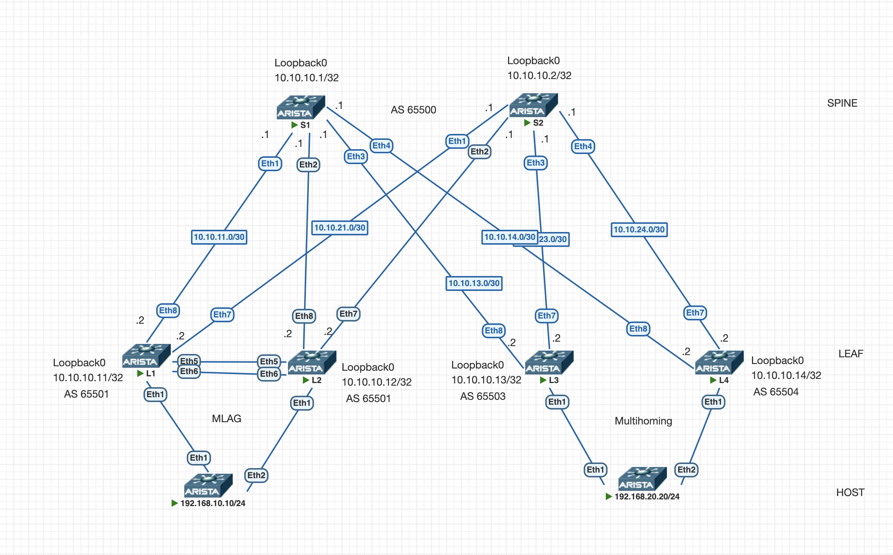

# VXLAN Multihoming/MLAG

## Цель

Настроить пару MLAG и пару Multihoming лифов в одной фабрике и проверить что хост, подключенный к первой паре может взаимодействовать с хостом, подключенным к другой паре.

---

## Схема

Протокол динамической маршрутизации BGP будет использоваться и в качестве underlay (eBGP), и в качестве overlay (AF evpn), чтобы избежать избыточной конфигурации. Подробнее о настройке eBGP underlay [здесь](https://github.com/bersenevns/home_work_otus/blob/main/hw4/README.md), подробнее о настройке EVPN L3VNI [здесь](https://github.com/bersenevns/home_work_otus/tree/main/hw6)

К каждой паре Leaf подключен 1 хост с помощью Port-Channel, один будет в vlan 10, второй в vlan 20.

В качестве L3VNI будет использоваться VNI 100100, будет настроен vrf VRF. Также будут настроен anycast gateway, который будет использоваться в качестве шлюза по умолчанию для хостов.



---

## Адресация

### Loopback-интерфейсы

| Устройство | Loopback0      | Loopback 1     |
|------------|----------------|----------------|
| S1         | 10.10.10.1/32  |                |
| S2         | 10.10.10.2/32  |                |
| L1         | 10.10.10.11/32 | 10.10.10.101/32|
| L2         | 10.10.10.12/32 | 10.10.10.102/32|
| L3         | 10.10.10.13/32 |                |
| L4         | 10.10.10.14/32 |                |

### AS-numbering

| Устройство | ASN   |
|------------|-------|
| S1         | 65500 |
| S2         | 65500 |
| L1         | 65501 |
| L2         | 65501 |
| L3         | 65503 |
| L4         | 65504 |

---

## Конфигурация

1) Настроен MLAG на LEAF-1, LEAF-2
2) В качестве downlink использовать LACP Port-Channel1
3) Anycast gateway
4) vrf VRF
5) Symmetic IRB
6) Multihoming на LEAF-3, LEAF-4

Конфигурация устройств представлена ниже, лишние строки удалены в целях читаемости.

<details>
<summary><b>Показать конфигурацию S1</b></summary>

```bash
service routing protocols model multi-agent
!
hostname S1
!
spanning-tree mode mstp
!
interface Ethernet1
   description L1
   mtu 9214
   no switchport
   ip address 10.10.11.1/30
!
interface Ethernet2
   description L2
   mtu 9214
   no switchport
   ip address 10.10.12.1/30
!
interface Ethernet3
   description L3
   mtu 9214
   no switchport
   ip address 10.10.13.1/30
!
interface Ethernet4
   description L4
   mtu 9214
   no switchport
   ip address 10.10.14.1/30
!
interface Loopback0
   ip address 10.10.10.1/32
!
ip routing
!
router bgp 65500
   router-id 10.10.10.1
   timers bgp 3 9
   maximum-paths 10 ecmp 10
   neighbor EVPN peer group
   neighbor EVPN next-hop-unchanged
   neighbor EVPN update-source Loopback0
   neighbor EVPN ebgp-multihop 3
   neighbor EVPN send-community extended
   neighbor UNDERLAY peer group
   neighbor UNDERLAY bfd
   neighbor UNDERLAY password 7 q1G/gCPAxox+izPj5OvcXw==
   neighbor 10.10.10.11 peer group EVPN
   neighbor 10.10.10.11 remote-as 65501
   neighbor 10.10.10.12 peer group EVPN
   neighbor 10.10.10.12 remote-as 65501
   neighbor 10.10.10.13 peer group EVPN
   neighbor 10.10.10.13 remote-as 65503
   neighbor 10.10.10.14 peer group EVPN
   neighbor 10.10.10.14 remote-as 65504
   neighbor 10.10.11.2 peer group UNDERLAY
   neighbor 10.10.11.2 remote-as 65501
   neighbor 10.10.11.2 description L1
   neighbor 10.10.12.2 peer group UNDERLAY
   neighbor 10.10.12.2 remote-as 65501
   neighbor 10.10.12.2 description L2
   neighbor 10.10.13.2 peer group UNDERLAY
   neighbor 10.10.13.2 remote-as 65503
   neighbor 10.10.13.2 description L3
   neighbor 10.10.14.2 peer group UNDERLAY
   neighbor 10.10.14.2 remote-as 65504
   neighbor 10.10.14.2 description L4
   !
   address-family evpn
      neighbor EVPN activate
   !
   address-family ipv4
      neighbor UNDERLAY activate
      network 10.10.10.1/32
!
end
```
</details>

<details>
<summary><b>Показать конфигурацию S2</b></summary>

```bash
service routing protocols model multi-agent
!
hostname S2
!
spanning-tree mode mstp
!
interface Ethernet1
   description L1
   mtu 9214
   no switchport
   ip address 10.10.21.1/30
!
interface Ethernet2
   description L2
   mtu 9214
   no switchport
   ip address 10.10.22.1/30
!
interface Ethernet3
   description L3
   mtu 9214
   no switchport
   ip address 10.10.23.1/30
!
interface Ethernet4
   description L4
   mtu 9214
   no switchport
   ip address 10.10.24.1/30
!
interface Loopback0
   ip address 10.10.10.2/32
!
ip routing
!
router bgp 65500
   router-id 10.10.10.2
   timers bgp 3 9
   maximum-paths 10 ecmp 10
   neighbor EVPN peer group
   neighbor EVPN next-hop-unchanged
   neighbor EVPN update-source Loopback0
   neighbor EVPN ebgp-multihop 3
   neighbor EVPN send-community extended
   neighbor UNDERLAY peer group
   neighbor UNDERLAY bfd
   neighbor UNDERLAY password 7 q1G/gCPAxox+izPj5OvcXw==
   neighbor 10.10.10.11 peer group EVPN
   neighbor 10.10.10.11 remote-as 65501
   neighbor 10.10.10.12 peer group EVPN
   neighbor 10.10.10.12 remote-as 65501
   neighbor 10.10.10.13 peer group EVPN
   neighbor 10.10.10.13 remote-as 65503
   neighbor 10.10.10.14 peer group EVPN
   neighbor 10.10.10.14 remote-as 65504
   neighbor 10.10.21.2 peer group UNDERLAY
   neighbor 10.10.21.2 remote-as 65501
   neighbor 10.10.21.2 description L1
   neighbor 10.10.22.2 peer group UNDERLAY
   neighbor 10.10.22.2 remote-as 65501
   neighbor 10.10.22.2 description L2
   neighbor 10.10.23.2 peer group UNDERLAY
   neighbor 10.10.23.2 remote-as 65503
   neighbor 10.10.23.2 description L3
   neighbor 10.10.24.2 peer group UNDERLAY
   neighbor 10.10.24.2 remote-as 65504
   neighbor 10.10.24.2 description L4
   !
   address-family evpn
      neighbor EVPN activate
   !
   address-family ipv4
      neighbor UNDERLAY activate
      network 10.10.10.2/32
!
end
```
</details>

<details>
<summary><b>Показать конфигурацию L1</b></summary>

```bash
service routing protocols model multi-agent
!
hostname L1
!
vlan 10,20,4094
!
vrf instance VRF
!
interface Port-Channel1
   switchport trunk allowed vlan 10
   switchport mode trunk
   mlag 1
!
interface Port-Channel100
   switchport mode trunk
!
interface Ethernet1
   channel-group 1 mode active
!
interface Ethernet5
   channel-group 100 mode active
!
interface Ethernet6
   channel-group 100 mode active
!
interface Ethernet7
   description S2
   no switchport
   ip address 10.10.21.2/30
!
interface Ethernet8
   description S1
   no switchport
   ip address 10.10.11.2/30
!
interface Loopback0
   ip address 10.10.10.11/32
!
interface Loopback1
   ip address 10.10.10.101/32
   ip address 10.10.10.100/32 secondary
!
interface Vlan10
   vrf VRF
   ip address virtual 192.168.10.1/24
!
interface Vlan20
   vrf VRF
   ip address virtual 192.168.20.1/24
!
interface Vlan4094
   ip address 10.1.1.1/30
!
interface Vxlan1
   vxlan udp-port 4789
   vxlan vlan 10 vni 10010
   vxlan vlan 20 vni 10020
   vxlan vrf VRF vni 100100
   vxlan mlag source-interface Loopback1
   vxlan learn-restrict any
!
ip virtual-router mac-address 02:00:00:00:00:00
!
ip routing
ip routing vrf VRF
!
mlag configuration
   domain-id MLAG
   local-interface Vlan4094
   peer-address 10.1.1.2
   peer-link Port-Channel100
!
router bgp 65501
   router-id 10.10.10.11
   timers bgp 3 9
   maximum-paths 10 ecmp 10
   neighbor EVPN peer group
   neighbor EVPN remote-as 65500
   neighbor EVPN update-source Loopback0
   neighbor EVPN ebgp-multihop 3
   neighbor EVPN send-community extended
   neighbor UNDERLAY peer group
   neighbor UNDERLAY remote-as 65500
   neighbor UNDERLAY bfd
   neighbor UNDERLAY password 7 q1G/gCPAxox+izPj5OvcXw==
   neighbor 10.1.1.2 remote-as 65501
   neighbor 10.1.1.2 next-hop-self
   neighbor 10.1.1.2 description PEER_MLAG
   neighbor 10.10.10.1 peer group EVPN
   neighbor 10.10.10.2 peer group EVPN
   neighbor 10.10.11.1 peer group UNDERLAY
   neighbor 10.10.21.1 peer group UNDERLAY
   !
   vlan 10
      rd 10.10.10.11:10
      route-target both 655:10
      redistribute learned
   !
   vlan 20
      rd 10.10.10.11:20
      route-target both 655:20
      redistribute learned
   !
   address-family evpn
      neighbor EVPN activate
   !
   address-family ipv4
      neighbor UNDERLAY activate
      neighbor 10.1.1.2 activate
      network 10.10.10.11/32
      network 10.10.10.101/32
   !
   vrf VRF
      rd 10.10.10.11:100
      route-target import evpn 655:100
      route-target export evpn 655:100
      redistribute connected
!
end
```
</details>

<details>
<summary><b>Показать конфигурацию L2</b></summary>

```bash
service routing protocols model multi-agent
!
hostname L2
!
vlan 10,20,4094
!
vrf instance VRF
!
interface Port-Channel1
   switchport trunk allowed vlan 10
   switchport mode trunk
   mlag 1
!
interface Port-Channel100
   switchport mode trunk
!
interface Ethernet1
   channel-group 1 mode active
!
interface Ethernet5
   channel-group 100 mode active
!
interface Ethernet6
   channel-group 100 mode active
!
interface Ethernet7
   description S2
   no switchport
   ip address 10.10.22.2/30
!
interface Ethernet8
   description S1
   no switchport
   ip address 10.10.12.2/30
!
interface Loopback0
   ip address 10.10.10.12/32
!
interface Loopback1
   ip address 10.10.10.102/32
   ip address 10.10.10.100/32 secondary
!
interface Vlan10
   vrf VRF
   ip address virtual 192.168.10.1/24
!
interface Vlan20
   vrf VRF
   ip address virtual 192.168.20.1/24
!
interface Vlan4094
   ip address 10.1.1.2/30
!
interface Vxlan1
   vxlan udp-port 4789
   vxlan vlan 10 vni 10010
   vxlan vlan 20 vni 10020
   vxlan vrf VRF vni 100100
   vxlan mlag source-interface Loopback1
!
ip virtual-router mac-address 02:00:00:00:00:00
!
ip routing
ip routing vrf VRF
!
mlag configuration
   domain-id MLAG
   local-interface Vlan4094
   peer-address 10.1.1.1
   peer-link Port-Channel100
!
router bgp 65501
   router-id 10.10.10.12
   timers bgp 3 9
   maximum-paths 10 ecmp 10
   neighbor EVPN peer group
   neighbor EVPN remote-as 65500
   neighbor EVPN update-source Loopback0
   neighbor EVPN ebgp-multihop 3
   neighbor EVPN send-community extended
   neighbor UNDERLAY peer group
   neighbor UNDERLAY remote-as 65500
   neighbor UNDERLAY bfd
   neighbor UNDERLAY password 7 q1G/gCPAxox+izPj5OvcXw==
   neighbor 10.1.1.1 remote-as 65501
   neighbor 10.1.1.1 next-hop-self
   neighbor 10.1.1.1 description PEER_MLAG
   neighbor 10.10.10.1 peer group EVPN
   neighbor 10.10.10.2 peer group EVPN
   neighbor 10.10.12.1 peer group UNDERLAY
   neighbor 10.10.22.1 peer group UNDERLAY
   !
   vlan 10
      rd 10.10.10.12:10
      route-target both 655:10
      redistribute learned
   !
   vlan 20
      rd 10.10.10.12:20
      route-target both 655:20
      redistribute learned
   !
   address-family evpn
      neighbor EVPN activate
   !
   address-family ipv4
      neighbor UNDERLAY activate
      neighbor 10.1.1.1 activate
      network 10.10.10.12/32
      network 10.10.10.102/32
   !
   vrf VRF
      rd 10.10.10.12:100
      route-target import evpn 655:100
      route-target export evpn 655:100
      redistribute connected
!
end
```
</details>

<details>
<summary><b>Показать конфигурацию L3</b></summary>

```bash
service routing protocols model multi-agent
!
hostname L3
!
vlan 10,20
!
vrf instance VRF
!
interface Port-Channel1
   description SERVER
   switchport trunk allowed vlan 20
   switchport mode trunk
   !
   evpn ethernet-segment
      identifier 0000:0000:0000:0000:0001
      designated-forwarder election algorithm preference 20
      route-target import 00:00:00:00:00:01
   lacp system-id 1111.2222.3333
!
interface Ethernet1
   description SERVER
   channel-group 1 mode active
!
interface Ethernet7
   mtu 9214
   no switchport
   ip address 10.10.23.2/30
!
interface Ethernet8
   mtu 9214
   no switchport
   ip address 10.10.13.2/30
!
interface Loopback0
   ip address 10.10.10.13/32
!
interface Vlan10
   vrf VRF
   ip address virtual 192.168.10.1/24
!
interface Vlan20
   vrf VRF
   ip address virtual 192.168.20.1/24
!
interface Vxlan1
   vxlan source-interface Loopback0
   vxlan udp-port 4789
   vxlan vlan 10 vni 10010
   vxlan vlan 20 vni 10020
   vxlan vrf VRF vni 100100
   vxlan learn-restrict any
!
ip virtual-router mac-address 00:00:00:00:00:01
!
ip routing
ip routing vrf VRF
!
router bgp 65503
   router-id 10.10.10.13
   timers bgp 3 9
   maximum-paths 2 ecmp 2
   neighbor EVPN peer group
   neighbor EVPN remote-as 65500
   neighbor EVPN update-source Loopback0
   neighbor EVPN ebgp-multihop 3
   neighbor EVPN send-community extended
   neighbor UNDERLAY peer group
   neighbor UNDERLAY remote-as 65500
   neighbor UNDERLAY bfd
   neighbor UNDERLAY password 7 q1G/gCPAxox+izPj5OvcXw==
   neighbor 10.10.10.1 peer group EVPN
   neighbor 10.10.10.2 peer group EVPN
   neighbor 10.10.13.1 peer group UNDERLAY
   neighbor 10.10.23.1 peer group UNDERLAY
   !
   vlan 10
      rd 10.10.10.13:10
      route-target both 655:10
      redistribute learned
   !
   vlan 20
      rd 10.10.10.13:20
      route-target both 655:20
      redistribute learned
   !
   address-family evpn
      neighbor EVPN activate
   !
   address-family ipv4
      neighbor UNDERLAY activate
      network 10.10.10.13/32
   !
   vrf VRF
      rd 10.10.10.13:100
      route-target import evpn 655:100
      route-target export evpn 655:100
      redistribute connected
!
end
```
</details>

<details>
<summary><b>Показать конфигурацию L4</b></summary>

```bash
service routing protocols model multi-agent
!
hostname L4
!
vlan 10,20
!
vrf instance VRF
!
interface Port-Channel1
   description SERVER
   switchport trunk allowed vlan 20
   switchport mode trunk
   !
   evpn ethernet-segment
      identifier 0000:0000:0000:0000:0001
      designated-forwarder election algorithm preference 50
      route-target import 00:00:00:00:00:01
   lacp system-id 1111.2222.3333
!
interface Ethernet1
   description SERVER
   channel-group 1 mode active
!
interface Ethernet7
   mtu 9214
   no switchport
   ip address 10.10.24.2/30
!
interface Ethernet8
   mtu 9214
   no switchport
   ip address 10.10.14.2/30
!
interface Loopback0
   ip address 10.10.10.14/32
!
interface Management1
!
interface Vlan10
   vrf VRF
   ip address virtual 192.168.10.1/24
!
interface Vlan20
   vrf VRF
   ip address virtual 192.168.20.1/24
!
interface Vxlan1
   vxlan source-interface Loopback0
   vxlan udp-port 4789
   vxlan vlan 10 vni 10010
   vxlan vlan 20 vni 10020
   vxlan vrf VRF vni 100100
   vxlan learn-restrict any
!
ip virtual-router mac-address 00:00:00:00:00:01
!
ip routing
ip routing vrf VRF
!
router bgp 65504
   router-id 10.10.10.14
   timers bgp 3 9
   maximum-paths 2 ecmp 2
   neighbor EVPN peer group
   neighbor EVPN remote-as 65500
   neighbor EVPN update-source Loopback0
   neighbor EVPN ebgp-multihop 3
   neighbor EVPN send-community extended
   neighbor UNDERLAY peer group
   neighbor UNDERLAY remote-as 65500
   neighbor UNDERLAY bfd
   neighbor UNDERLAY password 7 q1G/gCPAxox+izPj5OvcXw==
   neighbor 10.10.10.1 peer group EVPN
   neighbor 10.10.10.2 peer group EVPN
   neighbor 10.10.14.1 peer group UNDERLAY
   neighbor 10.10.24.1 peer group UNDERLAY
   !
   vlan 10
      rd 10.10.10.14:10
      route-target both 655:10
      redistribute learned
   !
   vlan 20
      rd 10.10.10.14:20
      route-target both 655:10
      redistribute learned
   !
   address-family evpn
      neighbor EVPN activate
   !
   address-family ipv4
      neighbor UNDERLAY activate
      network 10.10.10.14/32
   !
   vrf VRF
      rd 10.10.10.14:100
      route-target import evpn 655:100
      route-target export evpn 655:100
      redistribute connected
!
end
```
</details>

<details>
<summary><b>Показать конфигурацию HOST-1</b></summary>

```bash
service routing protocols model multi-agent
!
hostname HOST-1
!
spanning-tree mode mstp
!
vlan 10
!
interface Port-Channel1
   switchport trunk allowed vlan 10
   switchport mode trunk
!
interface Ethernet1
   channel-group 1 mode active
!
interface Ethernet2
   channel-group 1 mode active
!
interface Vlan10
   ip address 192.168.10.5/24
!
ip routing
!
ip route 0.0.0.0/0 192.168.10.1
!
end
```
</details>

<details>
<summary><b>Показать конфигурацию HOST-2</b></summary>

```bash
service routing protocols model multi-agent
!
hostname HOST-2
!
spanning-tree mode mstp
!
vlan 20
!
interface Port-Channel1
   switchport trunk allowed vlan 20
   switchport mode trunk
!
interface Ethernet1
   channel-group 1 mode active
!
interface Ethernet2
   channel-group 1 mode active
!
interface Vlan20
   ip address 192.168.20.5/24
!
ip routing
!
ip route 0.0.0.0/0 192.168.20.1
!
end
```
</details>

## Результаты

Опробуем запустить пинг между хостами, проверим таблицу соседства BGP, таблицу полученных от соседей префиксов ipv4, таблицу маршрутизации BGP, таблицу evpn route-type. Возьмем за основу LEAF-1 и LEAF-3.

<details>
<summary><b>Показать результаты на HOST-1</b></summary>

```bash
HOST-1#ping 192.168.20.5
PING 192.168.20.5 (192.168.20.5) 72(100) bytes of data.
80 bytes from 192.168.20.5: icmp_seq=1 ttl=63 time=187 ms
80 bytes from 192.168.20.5: icmp_seq=2 ttl=63 time=179 ms
80 bytes from 192.168.20.5: icmp_seq=3 ttl=63 time=175 ms
80 bytes from 192.168.20.5: icmp_seq=4 ttl=63 time=168 ms
80 bytes from 192.168.20.5: icmp_seq=5 ttl=63 time=163 ms

--- 192.168.20.5 ping statistics ---
5 packets transmitted, 5 received, 0% packet loss, time 47ms
rtt min/avg/max/mdev = 163.634/174.988/187.556/8.362 ms, pipe 5, ipg/ewma 11.837/180.678 ms
```
</details>

<details>
<summary><b>Показать результаты на L1</b></summary>

```bash
L1#sh bgp ipv4 unicast summary 
BGP summary information for VRF default
Router identifier 10.10.10.11, local AS number 65501
Neighbor Status Codes: m - Under maintenance
  Description              Neighbor   V AS           MsgRcvd   MsgSent  InQ OutQ  Up/Down State   PfxRcd PfxAcc
  PEER_MLAG                10.1.1.2   4 65501           3583      3590    0    0 00:54:48 Estab   6      6
                           10.10.10.1 4 65500           3297      3268    0    0 00:54:48 Estab   3      3
                           10.10.10.2 4 65500            604       606    0    0 00:24:41 Estab   3      3
                           10.10.11.1 4 65500           3708      3704    0    0 00:54:48 Estab   3      3
                           10.10.21.1 4 65500            590       590    0    0 00:24:42 Estab   3      3
L1#sh bgp ipv4 unicast 

          Network                Next Hop              Metric  AIGP       LocPref Weight  Path
 * >      10.10.10.1/32          10.10.11.1            0       -          100     0       65500 i
 *        10.10.10.1/32          10.10.10.1            0       -          100     0       65500 i
 *        10.10.10.1/32          10.1.1.2              0       -          100     0       65500 i
 * >      10.10.10.2/32          10.10.21.1            0       -          100     0       65500 i
 *        10.10.10.2/32          10.10.10.2            0       -          100     0       65500 i
 *        10.10.10.2/32          10.1.1.2              0       -          100     0       65500 i
 * >      10.10.10.11/32         -                     -       -          -       0       i
 * >      10.10.10.12/32         10.1.1.2              0       -          100     0       i
 * >Ec    10.10.10.13/32         10.10.11.1            0       -          100     0       65500 65503 i
 *  ec    10.10.10.13/32         10.10.21.1            0       -          100     0       65500 65503 i
 *        10.10.10.13/32         10.1.1.2              0       -          100     0       65500 65503 i
          10.10.10.13/32         10.10.13.2            0       -          100     0       65500 65503 i
          10.10.10.13/32         10.10.23.2            0       -          100     0       65500 65503 i
 * >Ec    10.10.10.14/32         10.10.11.1            0       -          100     0       65500 65504 i
 *  ec    10.10.10.14/32         10.10.21.1            0       -          100     0       65500 65504 i
 *        10.10.10.14/32         10.1.1.2              0       -          100     0       65500 65504 i
          10.10.10.14/32         10.10.14.2            0       -          100     0       65500 65504 i
          10.10.10.14/32         10.10.24.2            0       -          100     0       65500 65504 i
 * >      10.10.10.101/32        -                     -       -          -       0       i
 * >      10.10.10.102/32        10.1.1.2              0       -          100     0       i
L1#sh ip route bgp

 B E      10.10.10.1/32 [200/0] via 10.10.11.1, Ethernet8
 B E      10.10.10.2/32 [200/0] via 10.10.21.1, Ethernet7
 B I      10.10.10.12/32 [200/0] via 10.1.1.2, Vlan4094
 B E      10.10.10.13/32 [200/0] via 10.10.21.1, Ethernet7
                                 via 10.10.11.1, Ethernet8
 B E      10.10.10.14/32 [200/0] via 10.10.21.1, Ethernet7
                                 via 10.10.11.1, Ethernet8
 B I      10.10.10.102/32 [200/0] via 10.1.1.2, Vlan4094
L1#sh bgp evpn route-type imet 

          Network                Next Hop              Metric  LocPref Weight  Path
 * >Ec    RD: 10.10.10.13:10 imet 10.10.10.13
                                 10.10.10.13           -       100     0       65500 65503 i
 *  ec    RD: 10.10.10.13:10 imet 10.10.10.13
                                 10.10.10.13           -       100     0       65500 65503 i
 * >Ec    RD: 10.10.10.13:20 imet 10.10.10.13
                                 10.10.10.13           -       100     0       65500 65503 i
 *  ec    RD: 10.10.10.13:20 imet 10.10.10.13
                                 10.10.10.13           -       100     0       65500 65503 i
 * >Ec    RD: 10.10.10.14:10 imet 10.10.10.14
                                 10.10.10.14           -       100     0       65500 65504 i
 *  ec    RD: 10.10.10.14:10 imet 10.10.10.14
                                 10.10.10.14           -       100     0       65500 65504 i
 * >Ec    RD: 10.10.10.14:20 imet 10.10.10.14
                                 10.10.10.14           -       100     0       65500 65504 i
 *  ec    RD: 10.10.10.14:20 imet 10.10.10.14
                                 10.10.10.14           -       100     0       65500 65504 i
 * >      RD: 10.10.10.11:10 imet 10.10.10.101
                                 10.10.10.101          -       -       0       i
 * >      RD: 10.10.10.11:20 imet 10.10.10.101
                                 10.10.10.101          -       -       0       i
L1#sh bgp evpn route-type mac-ip

          Network                Next Hop              Metric  LocPref Weight  Path
 * >      RD: 10.10.10.11:10 mac-ip 507c.3b3e.64c6
                                 10.10.10.101          -       -       0       i
 * >      RD: 10.10.10.11:10 mac-ip 507c.3b3e.64c6 192.168.10.5
                                 10.10.10.101          -       -       0       i
 * >Ec    RD: 10.10.10.14:20 mac-ip 50f3.934d.4af6
                                 10.10.10.14           -       100     0       65500 65504 i
 *  ec    RD: 10.10.10.14:20 mac-ip 50f3.934d.4af6
                                 10.10.10.14           -       100     0       65500 65504 i
 * >Ec    RD: 10.10.10.14:20 mac-ip 50f3.934d.4af6 192.168.20.5
                                 10.10.10.14           -       100     0       65500 65504 i
 *  ec    RD: 10.10.10.14:20 mac-ip 50f3.934d.4af6 192.168.20.5
                                 10.10.10.14           -       100     0       65500 65504 i
L1#sh bgp evpn route-type auto-discovery 

          Network                Next Hop              Metric  LocPref Weight  Path
 * >Ec    RD: 10.10.10.13:20 auto-discovery 0 0000:0000:0000:0000:0001
                                 10.10.10.13           -       100     0       65500 65503 i
 *  ec    RD: 10.10.10.13:20 auto-discovery 0 0000:0000:0000:0000:0001
                                 10.10.10.13           -       100     0       65500 65503 i
 * >Ec    RD: 10.10.10.14:20 auto-discovery 0 0000:0000:0000:0000:0001
                                 10.10.10.14           -       100     0       65500 65504 i
 *  ec    RD: 10.10.10.14:20 auto-discovery 0 0000:0000:0000:0000:0001
                                 10.10.10.14           -       100     0       65500 65504 i
 * >Ec    RD: 10.10.10.13:1 auto-discovery 0000:0000:0000:0000:0001
                                 10.10.10.13           -       100     0       65500 65503 i
 *  ec    RD: 10.10.10.13:1 auto-discovery 0000:0000:0000:0000:0001
                                 10.10.10.13           -       100     0       65500 65503 i
 * >Ec    RD: 10.10.10.14:1 auto-discovery 0000:0000:0000:0000:0001
                                 10.10.10.14           -       100     0       65500 65504 i
 *  ec    RD: 10.10.10.14:1 auto-discovery 0000:0000:0000:0000:0001
                                 10.10.10.14           -       100     0       65500 65504 i
L1#sh bgp evpn route-type ethernet-segment 

          Network                Next Hop              Metric  LocPref Weight  Path
 * >Ec    RD: 10.10.10.13:1 ethernet-segment 0000:0000:0000:0000:0001 10.10.10.13
                                 10.10.10.13           -       100     0       65500 65503 i
 *  ec    RD: 10.10.10.13:1 ethernet-segment 0000:0000:0000:0000:0001 10.10.10.13
                                 10.10.10.13           -       100     0       65500 65503 i
 * >Ec    RD: 10.10.10.14:1 ethernet-segment 0000:0000:0000:0000:0001 10.10.10.14
                                 10.10.10.14           -       100     0       65500 65504 i
 *  ec    RD: 10.10.10.14:1 ethernet-segment 0000:0000:0000:0000:0001 10.10.10.14
                                 10.10.10.14           -       100     0       65500 65504 i
L1#sh bgp evpn route-type ip-prefix ipv4

          Network                Next Hop              Metric  LocPref Weight  Path
 * >      RD: 10.10.10.11:100 ip-prefix 192.168.10.0/24
                                 -                     -       -       0       i
 * >Ec    RD: 10.10.10.13:100 ip-prefix 192.168.10.0/24
                                 10.10.10.13           -       100     0       65500 65503 i
 *  ec    RD: 10.10.10.13:100 ip-prefix 192.168.10.0/24
                                 10.10.10.13           -       100     0       65500 65503 i
 * >Ec    RD: 10.10.10.14:100 ip-prefix 192.168.10.0/24
                                 10.10.10.14           -       100     0       65500 65504 i
 *  ec    RD: 10.10.10.14:100 ip-prefix 192.168.10.0/24
                                 10.10.10.14           -       100     0       65500 65504 i
 * >      RD: 10.10.10.11:100 ip-prefix 192.168.20.0/24
                                 -                     -       -       0       i
 * >Ec    RD: 10.10.10.13:100 ip-prefix 192.168.20.0/24
                                 10.10.10.13           -       100     0       65500 65503 i
 *  ec    RD: 10.10.10.13:100 ip-prefix 192.168.20.0/24
                                 10.10.10.13           -       100     0       65500 65503 i
 * >Ec    RD: 10.10.10.14:100 ip-prefix 192.168.20.0/24
                                 10.10.10.14           -       100     0       65500 65504 i
 *  ec    RD: 10.10.10.14:100 ip-prefix 192.168.20.0/24
                                 10.10.10.14           -       100     0       65500 65504 i
L1#sh mlag
MLAG Configuration:              
domain-id                          :                MLAG
local-interface                    :            Vlan4094
peer-address                       :            10.1.1.2
peer-link                          :     Port-Channel100
peer-config                        :          consistent
                                                       
MLAG Status:                     
state                              :              Active
negotiation status                 :           Connected
peer-link status                   :                  Up
local-int status                   :                  Up
system-id                          :   52:4e:75:48:d8:6d
dual-primary detection             :            Disabled
dual-primary interface errdisabled :               False
                                                       
MLAG Ports:                      
Disabled                           :                   0
Configured                         :                   0
Inactive                           :                   0
Active-partial                     :                   0
Active-full                        :                   1

```
</details>

<details>
<summary><b>Показать результаты на L3</b></summary>

```bash
L3#sh bgp ipv4 unicast summary 
BGP summary information for VRF default
Router identifier 10.10.10.13, local AS number 65503
Neighbor Status Codes: m - Under maintenance
  Neighbor   V AS           MsgRcvd   MsgSent  InQ OutQ  Up/Down State   PfxRcd PfxAcc
  10.10.10.1 4 65500           2377      2292    0    0 00:55:13 Estab   6      6
  10.10.10.2 4 65500            398       400    0    0 00:16:01 Estab   6      6
  10.10.13.1 4 65500           2399      2380    0    0 00:55:14 Estab   6      6
  10.10.23.1 4 65500            385       385    0    0 00:16:08 Estab   6      6
L3#sh bgp ipv4 unicast
          Network                Next Hop              Metric  AIGP       LocPref Weight  Path
 * >      10.10.10.1/32          10.10.13.1            0       -          100     0       65500 i
 *        10.10.10.1/32          10.10.10.1            0       -          100     0       65500 i
 * >      10.10.10.2/32          10.10.23.1            0       -          100     0       65500 i
 *        10.10.10.2/32          10.10.10.2            0       -          100     0       65500 i
 * >Ec    10.10.10.11/32         10.10.13.1            0       -          100     0       65500 65501 i
 *  ec    10.10.10.11/32         10.10.23.1            0       -          100     0       65500 65501 i
          10.10.10.11/32         10.10.12.2            0       -          100     0       65500 65501 i
          10.10.10.11/32         10.10.21.2            0       -          100     0       65500 65501 i
 * >Ec    10.10.10.12/32         10.10.13.1            0       -          100     0       65500 65501 i
 *  ec    10.10.10.12/32         10.10.23.1            0       -          100     0       65500 65501 i
          10.10.10.12/32         10.10.12.2            0       -          100     0       65500 65501 i
          10.10.10.12/32         10.10.21.2            0       -          100     0       65500 65501 i
 * >      10.10.10.13/32         -                     -       -          -       0       i
 * >Ec    10.10.10.14/32         10.10.13.1            0       -          100     0       65500 65504 i
 *  ec    10.10.10.14/32         10.10.23.1            0       -          100     0       65500 65504 i
          10.10.10.14/32         10.10.14.2            0       -          100     0       65500 65504 i
          10.10.10.14/32         10.10.24.2            0       -          100     0       65500 65504 i
 * >Ec    10.10.10.101/32        10.10.13.1            0       -          100     0       65500 65501 i
 *  ec    10.10.10.101/32        10.10.23.1            0       -          100     0       65500 65501 i
          10.10.10.101/32        10.10.12.2            0       -          100     0       65500 65501 i
          10.10.10.101/32        10.10.21.2            0       -          100     0       65500 65501 i
 * >Ec    10.10.10.102/32        10.10.13.1            0       -          100     0       65500 65501 i
 *  ec    10.10.10.102/32        10.10.23.1            0       -          100     0       65500 65501 i
          10.10.10.102/32        10.10.12.2            0       -          100     0       65500 65501 i
          10.10.10.102/32        10.10.21.2            0       -          100     0       65500 65501 i
L3#sh ip route bgp

 B E      10.10.10.1/32 [200/0] via 10.10.13.1, Ethernet8
 B E      10.10.10.2/32 [200/0] via 10.10.23.1, Ethernet7
 B E      10.10.10.11/32 [200/0] via 10.10.23.1, Ethernet7
                                 via 10.10.13.1, Ethernet8
 B E      10.10.10.12/32 [200/0] via 10.10.23.1, Ethernet7
                                 via 10.10.13.1, Ethernet8
 B E      10.10.10.14/32 [200/0] via 10.10.23.1, Ethernet7
                                 via 10.10.13.1, Ethernet8
 B E      10.10.10.101/32 [200/0] via 10.10.23.1, Ethernet7
                                  via 10.10.13.1, Ethernet8
 B E      10.10.10.102/32 [200/0] via 10.10.23.1, Ethernet7
                                  via 10.10.13.1, Ethernet8
L3#sh bgp evpn route-type imet
          Network                Next Hop              Metric  LocPref Weight  Path
 * >      RD: 10.10.10.13:10 imet 10.10.10.13
                                 -                     -       -       0       i
 * >      RD: 10.10.10.13:20 imet 10.10.10.13
                                 -                     -       -       0       i
 * >Ec    RD: 10.10.10.14:10 imet 10.10.10.14
                                 10.10.10.14           -       100     0       65500 65504 i
 *  ec    RD: 10.10.10.14:10 imet 10.10.10.14
                                 10.10.10.14           -       100     0       65500 65504 i
 * >Ec    RD: 10.10.10.14:20 imet 10.10.10.14
                                 10.10.10.14           -       100     0       65500 65504 i
 *  ec    RD: 10.10.10.14:20 imet 10.10.10.14
                                 10.10.10.14           -       100     0       65500 65504 i
 * >Ec    RD: 10.10.10.11:10 imet 10.10.10.101
                                 10.10.10.101          -       100     0       65500 65501 i
 *  ec    RD: 10.10.10.11:10 imet 10.10.10.101
                                 10.10.10.101          -       100     0       65500 65501 i
 * >Ec    RD: 10.10.10.11:20 imet 10.10.10.101
                                 10.10.10.101          -       100     0       65500 65501 i
 *  ec    RD: 10.10.10.11:20 imet 10.10.10.101
                                 10.10.10.101          -       100     0       65500 65501 i
 * >Ec    RD: 10.10.10.12:10 imet 10.10.10.102
                                 10.10.10.102          -       100     0       65500 65501 i
 *  ec    RD: 10.10.10.12:10 imet 10.10.10.102
                                 10.10.10.102          -       100     0       65500 65501 i
 * >Ec    RD: 10.10.10.12:20 imet 10.10.10.102
                                 10.10.10.102          -       100     0       65500 65501 i
 *  ec    RD: 10.10.10.12:20 imet 10.10.10.102
                                 10.10.10.102          -       100     0       65500 65501 i
L3#sh bgp evpn route-type mac-ip 

          Network                Next Hop              Metric  LocPref Weight  Path
 * >Ec    RD: 10.10.10.11:10 mac-ip 507c.3b3e.64c6
                                 10.10.10.101          -       100     0       65500 65501 i
 *  ec    RD: 10.10.10.11:10 mac-ip 507c.3b3e.64c6
                                 10.10.10.101          -       100     0       65500 65501 i
 * >Ec    RD: 10.10.10.12:10 mac-ip 507c.3b3e.64c6
                                 10.10.10.102          -       100     0       65500 65501 i
 *  ec    RD: 10.10.10.12:10 mac-ip 507c.3b3e.64c6
                                 10.10.10.102          -       100     0       65500 65501 i
 * >Ec    RD: 10.10.10.11:10 mac-ip 507c.3b3e.64c6 192.168.10.5
                                 10.10.10.101          -       100     0       65500 65501 i
 *  ec    RD: 10.10.10.11:10 mac-ip 507c.3b3e.64c6 192.168.10.5
                                 10.10.10.101          -       100     0       65500 65501 i
 * >Ec    RD: 10.10.10.12:10 mac-ip 507c.3b3e.64c6 192.168.10.5
                                 10.10.10.102          -       100     0       65500 65501 i
 *  ec    RD: 10.10.10.12:10 mac-ip 507c.3b3e.64c6 192.168.10.5
                                 10.10.10.102          -       100     0       65500 65501 i
 * >Ec    RD: 10.10.10.14:20 mac-ip 50f3.934d.4af6
                                 10.10.10.14           -       100     0       65500 65504 i
 *  ec    RD: 10.10.10.14:20 mac-ip 50f3.934d.4af6
                                 10.10.10.14           -       100     0       65500 65504 i
 * >Ec    RD: 10.10.10.14:20 mac-ip 50f3.934d.4af6 192.168.20.5
                                 10.10.10.14           -       100     0       65500 65504 i
 *  ec    RD: 10.10.10.14:20 mac-ip 50f3.934d.4af6 192.168.20.5
                                 10.10.10.14           -       100     0       65500 65504 i
L3#sh bgp evpn route-type auto-discovery 

          Network                Next Hop              Metric  LocPref Weight  Path
 * >      RD: 10.10.10.13:20 auto-discovery 0 0000:0000:0000:0000:0001
                                 -                     -       -       0       i
 * >Ec    RD: 10.10.10.14:20 auto-discovery 0 0000:0000:0000:0000:0001
                                 10.10.10.14           -       100     0       65500 65504 i
 *  ec    RD: 10.10.10.14:20 auto-discovery 0 0000:0000:0000:0000:0001
                                 10.10.10.14           -       100     0       65500 65504 i
 * >      RD: 10.10.10.13:1 auto-discovery 0000:0000:0000:0000:0001
                                 -                     -       -       0       i
 * >Ec    RD: 10.10.10.14:1 auto-discovery 0000:0000:0000:0000:0001
                                 10.10.10.14           -       100     0       65500 65504 i
 *  ec    RD: 10.10.10.14:1 auto-discovery 0000:0000:0000:0000:0001
                                 10.10.10.14           -       100     0       65500 65504 i
L3#sh bgp evpn route-type ethernet-segment 

          Network                Next Hop              Metric  LocPref Weight  Path
 * >      RD: 10.10.10.13:1 ethernet-segment 0000:0000:0000:0000:0001 10.10.10.13
                                 -                     -       -       0       i
 * >Ec    RD: 10.10.10.14:1 ethernet-segment 0000:0000:0000:0000:0001 10.10.10.14
                                 10.10.10.14           -       100     0       65500 65504 i
 *  ec    RD: 10.10.10.14:1 ethernet-segment 0000:0000:0000:0000:0001 10.10.10.14
                                 10.10.10.14           -       100     0       65500 65504 i
L3#sh bgp evpn route-type ip-prefix ipv4
          Network                Next Hop              Metric  LocPref Weight  Path
          RD: 10.10.10.11:100 ip-prefix 192.168.10.0/24
                                 10.10.10.101          -       100     0       65500 65501 i
          RD: 10.10.10.11:100 ip-prefix 192.168.10.0/24
                                 10.10.10.101          -       100     0       65500 65501 i
 * >Ec    RD: 10.10.10.12:100 ip-prefix 192.168.10.0/24
                                 10.10.10.102          -       100     0       65500 65501 i
 *  ec    RD: 10.10.10.12:100 ip-prefix 192.168.10.0/24
                                 10.10.10.102          -       100     0       65500 65501 i
 * >      RD: 10.10.10.13:100 ip-prefix 192.168.10.0/24
                                 -                     -       -       0       i
 * >Ec    RD: 10.10.10.14:100 ip-prefix 192.168.10.0/24
                                 10.10.10.14           -       100     0       65500 65504 i
 *  ec    RD: 10.10.10.14:100 ip-prefix 192.168.10.0/24
                                 10.10.10.14           -       100     0       65500 65504 i
          RD: 10.10.10.11:100 ip-prefix 192.168.20.0/24
                                 10.10.10.101          -       100     0       65500 65501 i
          RD: 10.10.10.11:100 ip-prefix 192.168.20.0/24
                                 10.10.10.101          -       100     0       65500 65501 i
 * >Ec    RD: 10.10.10.12:100 ip-prefix 192.168.20.0/24
                                 10.10.10.102          -       100     0       65500 65501 i
 *  ec    RD: 10.10.10.12:100 ip-prefix 192.168.20.0/24
                                 10.10.10.102          -       100     0       65500 65501 i
 * >      RD: 10.10.10.13:100 ip-prefix 192.168.20.0/24
                                 -                     -       -       0       i
 * >Ec    RD: 10.10.10.14:100 ip-prefix 192.168.20.0/24
                                 10.10.10.14           -       100     0       65500 65504 i
 *  ec    RD: 10.10.10.14:100 ip-prefix 192.168.20.0/24
                                 10.10.10.14           -       100     0       65500 65504 i

```
</details>

Все необходимые маршруты изучены, MLAG активен, Multihoming работает (видно по маршрутам ethernet-segment).
Ping успешен, задача выполнена!


