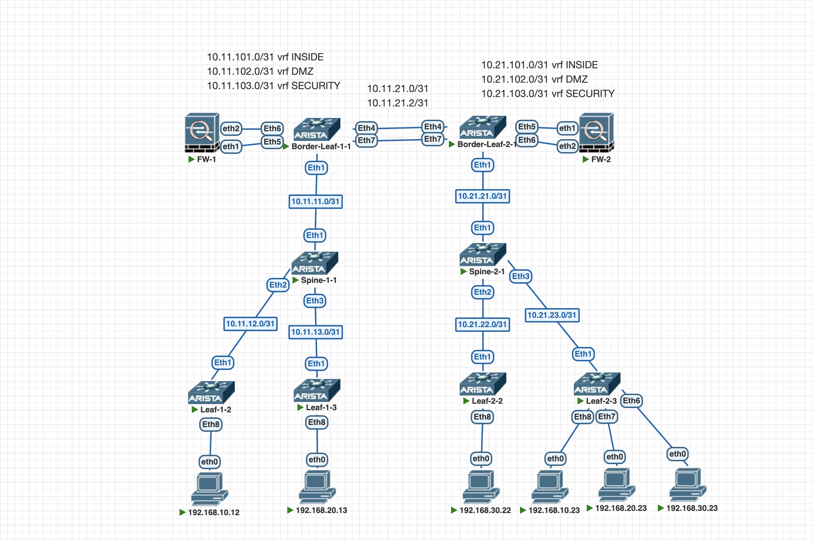

# Итоговый проект

## Цель

Настроить сеть двух ЦОД по модели Active-Active с межсегментной фильтрацией трафика при помощи VxLAN EVPN.

Хосты в одной сети могут взаимодействовать друг с другом по L2 между ЦОД.

Выход из каждого ЦОД должен быть локальным, без использования межцодового канала.

Маршрутизация между сегментами сети должна осуществляться только через Firewall.

Проблему симметричного обратного трафика решитьс помощью SNAT на локальном Firewall.

---

## Схема

Протокол динамической маршрутизации BGP будет использоваться и в качестве underlay (eBGP), и в качестве overlay (AF evpn).

Выделено три сегмента: INSIDE (vlan 10), DMZ (vlan 20), SECURITY (vlan 30).

| mapping      | VNI       | 
|--------------|-----------|
| Vlan 10      | vni 10010 | 
| Vlan 20      | vni 10020 | 
| Vlan 30      | vni 10030 |
| vrf INSIDE   | vni 10100 |
| vrf DMZ      | vni 10200 |
| vrf SECURITY | vni 10300 |

VyOS будет выполнять роль FW, FW подключен к Border Leaf в каждом ЦОД. FW анонсирует дефолтный маршрут по всей фабрике (для простоты дефолт будет статический redistributed).

Между двумя Border Leafs два routed линка. Между Border и FW создан статический Port-Channel с сабинтерфейсами для каждого vrf соседства.



---

## Адресация

### Loopback-интерфейсы

| Устройство      | Loopback0       |
|------------     |-----------------|
| Spine-1-1       | 10.10.10.101/32 |
| Border-Leaf-1-1 | 10.10.10.11/32  |
| Leaf-1-2        | 10.10.10.12/32  |
| Leaf-1-3        | 10.10.10.13/32  |
| Spine-2-1       | 10.10.10.201/32 |
| Border-Leaf-2-1 | 10.10.10.21/32  |
| Leaf-2-2        | 10.10.10.22/32  |
| Leaf-2-3        | 10.10.10.23/32  |

### AS-numbering

| Устройство      | ASN   |
|-----------------|-------|
| FW-1            | 65501 |
| Spine-1-1       | 65510 |
| Border-Leaf-1-1 | 65511 |
| Leaf-1-2        | 65512 |
| Leaf-1-3        | 65513 |
| FW-2            | 65502 |
| Spine-2-1       | 65520 |
| Border-Leaf-2-1 | 65521 |
| Leaf-2-2        | 65522 |
| Leaf-2-3        | 65523 |

---

## Конфигурация

1) Настраиваем BGP-соседство в address-family ipv4
2) Настраиваем BGP-соседство с loopback0 в address-family evpn
3) Настраиваем интерфейсы VLAN 10,20,30  разных VRF
4) Настраиваем Anycast gateway на Leafs
5) Настраиваем BGP-соседство между Border Leaf и FW для передачи дефолтного маршрута в фабрику и префиксов из фабрики
6) Проверяем связанность между VRF на хостах как в одном ЦОД, так и между ЦОД

Конфигурация устройств представлена ниже, лишние строки удалены в целях читаемости.

<details>
<summary><b>Показать конфигурацию Spine-1-1</b></summary>

```bash
service routing protocols model multi-agent
!
hostname Spine-1-1
!
interface Ethernet1
   description Border-Leaf-1-1
   mtu 9214
   no switchport
   ip address 10.11.11.1/31
!
interface Ethernet2
   description Leaf-1-2
   mtu 9214
   no switchport
   ip address 10.11.12.1/31
!
interface Ethernet3
   description Leaf-1-3
   mtu 9214
   no switchport
   ip address 10.11.13.1/31
!
interface lo0
   ip add 10.10.10.101/32
!
ip routing
!
router bgp 65510
   router-id 10.10.10.101
   no bgp default ipv4-unicast
   timers bgp 3 9
   maximum-paths 4 ecmp 4
   neighbor 10.10.10.11 remote-as 65511
   neighbor 10.10.10.11 update-source Loopback0
   neighbor 10.10.10.11 description Border-Leaf-1-1
   neighbor 10.10.10.11 ebgp-multihop 3
   neighbor 10.10.10.11 send-community extended
   neighbor 10.10.10.12 remote-as 65512
   neighbor 10.10.10.12 update-source Loopback0
   neighbor 10.10.10.12 description Leaf-1-2
   neighbor 10.10.10.12 ebgp-multihop 3
   neighbor 10.10.10.12 send-community extended
   neighbor 10.10.10.13 remote-as 65513
   neighbor 10.10.10.13 update-source Loopback0
   neighbor 10.10.10.13 description Leaf-1-3
   neighbor 10.10.10.13 ebgp-multihop 3
   neighbor 10.10.10.13 send-community extended
   neighbor 10.11.11.0 remote-as 65511
   neighbor 10.11.11.0 bfd
   neighbor 10.11.11.0 description Border-Leaf-1-1
   neighbor 10.11.12.0 remote-as 65512
   neighbor 10.11.12.0 bfd
   neighbor 10.11.12.0 description Leaf-1-2
   neighbor 10.11.13.0 remote-as 65513
   neighbor 10.11.13.0 bfd
   neighbor 10.11.13.0 description Leaf-1-3
   !
   address-family evpn
      bgp next-hop-unchanged
      neighbor 10.10.10.11 activate
      neighbor 10.10.10.12 activate
      neighbor 10.10.10.13 activate
   !
   address-family ipv4
      neighbor 10.11.11.0 activate
      neighbor 10.11.12.0 activate
      neighbor 10.11.13.0 activate
      network 10.10.10.101/32
!
end

```
</details>

<details>
<summary><b>Показать конфигурацию Border-Leaf-1-1</b></summary>

```bash
service routing protocols model multi-agent
!
hostname Border-Leaf-1-1
!
vlan 10
   name INSIDE
!
vlan 101
   name FW_INSIDE
!
vlan 102
   name FW_DMZ
!
vlan 103
   name FW_SECURITY
!
vlan 20
   name DMZ
!
vlan 30
   name SECURITY
!
vrf instance DMZ
!
vrf instance INSIDE
!
vrf instance SECURITY
!
interface Port-Channel1
   mtu 9214
   no switchport
!
interface Port-Channel1.101
   encapsulation dot1q vlan 101
   vrf INSIDE
   ip address 10.11.101.0/31
!
interface Port-Channel1.102
   encapsulation dot1q vlan 102
   vrf DMZ
   ip address 10.11.102.0/31
!
interface Port-Channel1.103
   encapsulation dot1q vlan 103
   vrf SECURITY
   ip address 10.11.103.0/31
!
interface Ethernet1
   description Spine-1-1
   mtu 9214
   no switchport
   ip address 10.11.11.0/31
!
interface Ethernet4
   description Leaf-2-1
   mtu 9214
   no switchport
   ip address 10.11.21.1/31
!
interface Ethernet5
   channel-group 1 mode on
!
interface Ethernet6
   channel-group 1 mode on
!
interface Ethernet7
   description Leaf-2-1
   mtu 9214
   no switchport
   ip address 10.11.21.3/31
!
interface Loopback0
   ip address 10.10.10.11/32
!
interface Vxlan1
   vxlan source-interface Loopback0
   vxlan udp-port 4789
   vxlan vlan 10 vni 10010
   vxlan vlan 20 vni 10020
   vxlan vlan 30 vni 10030
   vxlan vrf DMZ vni 10200
   vxlan vrf INSIDE vni 10100
   vxlan vrf SECURITY vni 10300
!
ip routing
ip routing vrf DMZ
ip routing vrf INSIDE
ip routing vrf SECURITY
!
router bgp 65511
   router-id 10.10.10.11
   no bgp default ipv4-unicast
   timers bgp 3 9
   maximum-paths 4 ecmp 4
   neighbor 10.10.10.21 remote-as 65521
   neighbor 10.10.10.21 update-source Loopback0
   neighbor 10.10.10.21 description Leaf-2-1
   neighbor 10.10.10.21 ebgp-multihop 3
   neighbor 10.10.10.21 send-community extended
   neighbor 10.10.10.101 remote-as 65510
   neighbor 10.10.10.101 update-source Loopback0
   neighbor 10.10.10.101 description Spine-1-1
   neighbor 10.10.10.101 ebgp-multihop 3
   neighbor 10.10.10.101 send-community extended
   neighbor 10.11.11.1 remote-as 65510
   neighbor 10.11.11.1 bfd
   neighbor 10.11.11.1 description Spine-1-1
   neighbor 10.11.21.0 remote-as 65521
   neighbor 10.11.21.0 bfd
   neighbor 10.11.21.0 description Leaf-2-1
   neighbor 10.11.21.2 remote-as 65521
   neighbor 10.11.21.2 bfd
   neighbor 10.11.21.2 description Leaf-2-1
   !
   vlan 10
      rd 10.10.10.11:10
      route-target both 10:10
      redistribute learned
   !
   vlan 20
      rd 10.10.10.11:20
      route-target both 20:20
      redistribute learned
   !
   vlan 30
      rd 10.10.10.11:30
      route-target both 30:30
      redistribute learned
   !
   address-family evpn
      neighbor 10.10.10.21 activate
      neighbor 10.10.10.101 activate
   !
   address-family ipv4
      neighbor 10.11.11.1 activate
      neighbor 10.11.21.0 activate
      neighbor 10.11.21.2 activate
      network 10.10.10.11/32
   !
   vrf DMZ
      rd 10.10.10.11:200
      route-target import evpn 200:200
      route-target export evpn 200:200
      neighbor 10.11.102.1 remote-as 65501
      redistribute connected
      !
      address-family ipv4
         neighbor 10.11.102.1 activate
   !
   vrf INSIDE
      rd 10.10.10.11:100
      route-target import evpn 100:100
      route-target export evpn 100:100
      neighbor 10.11.101.1 remote-as 65501
      redistribute connected
      !
      address-family ipv4
         neighbor 10.11.101.1 activate
   !
   vrf SECURITY
      rd 10.10.10.11:300
      route-target import evpn 300:300
      route-target export evpn 300:300
      neighbor 10.11.103.1 remote-as 65501
      redistribute connected
      !
      address-family ipv4
         neighbor 10.11.103.1 activate
!
end
```
</details>

<details>
<summary><b>Показать конфигурацию Leaf-1-2</b></summary>

```bash
service routing protocols model multi-agent
!
hostname Leaf-1-2
!
vlan 10
   name INSIDE
!
vlan 20
   name DMZ
!
vlan 30
   name SECURITY
!
vrf instance DMZ
!
vrf instance INSIDE
!
vrf instance SECURITY
!
interface Ethernet1
   description Spine-1-1
   mtu 9214
   no switchport
   ip address 10.11.12.0/31
!
interface Ethernet8
   description VLAN_10
   mtu 9214
   switchport access vlan 10
!
interface Loopback0
   ip address 10.10.10.12/32
!
interface Vlan10
   mtu 9214
   vrf INSIDE
   ip address virtual 192.168.10.1/24
!
interface Vlan20
   mtu 9214
   vrf DMZ
   ip address virtual 192.168.20.1/24
!
interface Vlan30
   mtu 9214
   vrf SECURITY
   ip address virtual 192.168.30.1/24
!
interface Vxlan1
   vxlan source-interface Loopback0
   vxlan udp-port 4789
   vxlan vlan 10 vni 10010
   vxlan vlan 20 vni 10020
   vxlan vlan 30 vni 10030
   vxlan vrf DMZ vni 10200
   vxlan vrf INSIDE vni 10100
   vxlan vrf SECURITY vni 10300
!
ip virtual-router mac-address 00:00:11:11:22:22
!
ip routing
ip routing vrf DMZ
ip routing vrf INSIDE
ip routing vrf SECURITY
!
router bgp 65512
   router-id 10.10.10.12
   no bgp default ipv4-unicast
   timers bgp 3 9
   maximum-paths 4 ecmp 4
   neighbor 10.10.10.101 remote-as 65510
   neighbor 10.10.10.101 update-source Loopback0
   neighbor 10.10.10.101 description Spine-1-1
   neighbor 10.10.10.101 ebgp-multihop 3
   neighbor 10.10.10.101 send-community extended
   neighbor 10.11.12.1 remote-as 65510
   neighbor 10.11.12.1 bfd
   neighbor 10.11.12.1 description Spine-1-1
   !
   vlan 10
      rd 10.10.10.12:10
      route-target both 10:10
      redistribute learned
   !
   vlan 20
      rd 10.10.10.12:20
      route-target both 20:20
      redistribute learned
   !
   vlan 30
      rd 10.10.10.12:30
      route-target both 30:30
      redistribute learned
   !
   address-family evpn
      neighbor 10.10.10.101 activate
   !
   address-family ipv4
      neighbor 10.11.12.1 activate
      network 10.10.10.12/32
   !
   vrf DMZ
      rd 10.10.10.12:200
      route-target import evpn 200:200
      route-target export evpn 200:200
      redistribute connected
   !
   vrf INSIDE
      rd 10.10.10.12:100
      route-target import evpn 100:100
      route-target export evpn 100:100
      redistribute connected
   !
   vrf SECURITY
      rd 10.10.10.12:300
      route-target import evpn 300:300
      route-target export evpn 300:300
      redistribute connected
!
end
```
</details>

<details>
<summary><b>Показать конфигурацию Leaf-1-3</b></summary>

```bash
service routing protocols model multi-agent
!
hostname Leaf-1-3
!
vlan 10
   name INSIDE
!
vlan 20
   name DMZ
!
vlan 30
   name SECURITY
!
vrf instance DMZ
!
vrf instance INSIDE
!
vrf instance SECURITY
!
interface Ethernet1
   description Spine-1-1
   mtu 9214
   no switchport
   ip address 10.11.13.0/31
!
interface Ethernet8
   description VLAN_20
   mtu 9214
   switchport access vlan 20
!
interface Loopback0
   ip address 10.10.10.13/32
!
interface Vlan10
   mtu 9214
   vrf INSIDE
   ip address virtual 192.168.10.1/24
!
interface Vlan20
   mtu 9214
   vrf DMZ
   ip address virtual 192.168.20.1/24
!
interface Vlan30
   mtu 9214
   vrf SECURITY
   ip address virtual 192.168.30.1/24
!
interface Vxlan1
   vxlan source-interface Loopback0
   vxlan udp-port 4789
   vxlan vlan 10 vni 10010
   vxlan vlan 20 vni 10020
   vxlan vlan 30 vni 10030
   vxlan vrf DMZ vni 10200
   vxlan vrf INSIDE vni 10100
   vxlan vrf SECURITY vni 10300
!
ip virtual-router mac-address 00:00:11:11:22:22
!
ip routing
ip routing vrf DMZ
ip routing vrf INSIDE
ip routing vrf SECURITY
!
router bgp 65513
   router-id 10.10.10.13
   no bgp default ipv4-unicast
   timers bgp 3 9
   maximum-paths 4 ecmp 4
   neighbor 10.10.10.101 remote-as 65510
   neighbor 10.10.10.101 update-source Loopback0
   neighbor 10.10.10.101 description Spine-1-1
   neighbor 10.10.10.101 ebgp-multihop 3
   neighbor 10.10.10.101 send-community extended
   neighbor 10.11.13.1 remote-as 65510
   neighbor 10.11.13.1 bfd
   neighbor 10.11.13.1 description Spine-1-1
   !
   vlan 10
      rd 10.10.10.13:10
      route-target both 10:10
      redistribute learned
   !
   vlan 20
      rd 10.10.10.13:20
      route-target both 20:20
      redistribute learned
   !
   vlan 30
      rd 10.10.10.13:30
      route-target both 30:30
      redistribute learned
   !
   address-family evpn
      neighbor 10.10.10.101 activate
   !
   address-family ipv4
      neighbor 10.11.13.1 activate
      network 10.10.10.13/32
   !
   vrf DMZ
      rd 10.10.10.13:200
      route-target import evpn 200:200
      route-target export evpn 200:200
      redistribute connected
   !
   vrf INSIDE
      rd 10.10.10.13:100
      route-target import evpn 100:100
      route-target export evpn 100:100
      redistribute connected
   !
   vrf SECURITY
      rd 10.10.10.13:300
      route-target import evpn 300:300
      route-target export evpn 300:300
      redistribute connected
!
end
```
</details>

<details>
<summary><b>Показать конфигурацию FW-1</b></summary>

```bash
configure

set interfaces bonding bond0 mode xor-hash
set interfaces bonding bond0 member interface eth1
set interfaces bonding bond0 member interface eth2

set interfaces bonding bond0 vif 101 address '10.11.101.1/31'
set interfaces bonding bond0 vif 102 address '10.11.102.1/31'
set interfaces bonding bond0 vif 103 address '10.11.103.1/31'

set protocols bgp system-as '65501'

set protocols bgp neighbor 10.11.101.0 remote-as '65511'
set protocols bgp neighbor 10.11.102.0 remote-as '65511'
set protocols bgp neighbor 10.11.103.0 remote-as '65511'

set protocols static route 0.0.0.0/0 next-hop 1.1.1.1

set protocols bgp neighbor 10.11.101.0 address-family ipv4-unicast default-originate
set protocols bgp neighbor 10.11.102.0 address-family ipv4-unicast default-originate
set protocols bgp neighbor 10.11.103.0 address-family ipv4-unicast default-originate

set nat source rule 10 source address '192.168.10.0/24'
set nat source rule 10 destination address '192.168.20.0/24'
set nat source rule 10 outbound-interface name 'bond0.102'
set nat source rule 10 translation address 'masquerade'

set nat source rule 20 source address '192.168.10.0/24'
set nat source rule 20 destination address '192.168.30.0/24'
set nat source rule 20 outbound-interface name 'bond0.103'
set nat source rule 20 translation address 'masquerade'

set nat source rule 30 source address '192.168.20.0/24'
set nat source rule 30 destination address '192.168.10.0/24'
set nat source rule 30 outbound-interface name 'bond0.101'
set nat source rule 30 translation address 'masquerade'

set nat source rule 40 source address '192.168.20.0/24'
set nat source rule 40 destination address '192.168.30.0/24'
set nat source rule 40 outbound-interface name 'bond0.103'
set nat source rule 40 translation address 'masquerade'

set nat source rule 50 source address '192.168.30.0/24'
set nat source rule 50 destination address '192.168.10.0/24'
set nat source rule 50 outbound-interface name 'bond0.101'
set nat source rule 50 translation address 'masquerade'

set nat source rule 60 source address '192.168.30.0/24'
set nat source rule 60 destination address '192.168.20.0/24'
set nat source rule 60 outbound-interface name 'bond0.102'
set nat source rule 60 translation address 'masquerade'

commit
save
```
</details>

<details>
<summary><b>Показать конфигурацию Spine-2-1</b></summary>

```bash
service routing protocols model multi-agent
!
hostname Spine-2-1
!
interface Ethernet1
   description Border-Leaf-2-1
   mtu 9214
   no switchport
   ip address 10.21.21.1/31
!
interface Ethernet2
   description Leaf-2-2
   mtu 9214
   no switchport
   ip address 10.21.22.1/31
!
interface Ethernet3
   description Leaf-2-3
   mtu 9214
   no switchport
   ip address 10.21.23.1/31
!
interface lo0
   ip add 10.10.10.201/32
!
ip routing
!
router bgp 65520
   router-id 10.10.10.201
   no bgp default ipv4-unicast
   timers bgp 3 9
   maximum-paths 4 ecmp 4
   neighbor 10.10.10.21 remote-as 65521
   neighbor 10.10.10.21 update-source Loopback0
   neighbor 10.10.10.21 description Border-Leaf-2-1
   neighbor 10.10.10.21 ebgp-multihop 3
   neighbor 10.10.10.21 send-community extended
   neighbor 10.10.10.22 remote-as 65522
   neighbor 10.10.10.22 update-source Loopback0
   neighbor 10.10.10.22 description Leaf-2-2
   neighbor 10.10.10.22 ebgp-multihop 3
   neighbor 10.10.10.22 send-community extended
   neighbor 10.10.10.23 remote-as 65523
   neighbor 10.10.10.23 update-source Loopback0
   neighbor 10.10.10.23 description Leaf-2-3
   neighbor 10.10.10.23 ebgp-multihop 3
   neighbor 10.10.10.23 send-community extended
   neighbor 10.21.21.0 remote-as 65521
   neighbor 10.21.21.0 bfd
   neighbor 10.21.21.0 description Border-Leaf-2-1
   neighbor 10.21.22.0 remote-as 65522
   neighbor 10.21.22.0 bfd
   neighbor 10.21.22.0 description Leaf-2-2
   neighbor 10.21.23.0 remote-as 65523
   neighbor 10.21.23.0 bfd
   neighbor 10.21.23.0 description Leaf-2-3
   !
   address-family evpn
      bgp next-hop-unchanged
      neighbor 10.10.10.21 activate
      neighbor 10.10.10.22 activate
      neighbor 10.10.10.23 activate
   !
   address-family ipv4
      neighbor 10.21.21.0 activate
      neighbor 10.21.22.0 activate
      neighbor 10.21.23.0 activate
      network 10.10.10.201/32
!
end
```
</details>

<details>
<summary><b>Показать конфигурацию Border-Leaf-2-1</b></summary>

```bash
service routing protocols model multi-agent
!
hostname Border-Leaf-2-1
!
vlan 10
   name INSIDE
!
vlan 101
   name FW_INSIDE
!
vlan 102
   name FW_DMZ
!
vlan 103
   name FW_SECURITY
!
vlan 20
   name DMZ
!
vlan 30
   name SECURITY
!
vrf instance DMZ
!
vrf instance INSIDE
!
vrf instance SECURITY
!
interface Port-Channel1
   mtu 9214
   no switchport
!
interface Port-Channel1.101
   encapsulation dot1q vlan 101
   vrf INSIDE
   ip address 10.21.101.0/31
!
interface Port-Channel1.102
   encapsulation dot1q vlan 102
   vrf DMZ
   ip address 10.21.102.0/31
!
interface Port-Channel1.103
   encapsulation dot1q vlan 103
   vrf SECURITY
   ip address 10.21.103.0/31
!
interface Ethernet1
   description Spine-2-1
   mtu 9214
   no switchport
   ip address 10.21.21.0/31
!
interface Ethernet4
   description Leaf-1-1
   mtu 9214
   no switchport
   ip address 10.11.21.0/31
!
interface Ethernet5
   channel-group 1 mode on
!
interface Ethernet6
   channel-group 1 mode on
!
interface Ethernet7
   description Leaf-1-1
   mtu 9214
   no switchport
   ip address 10.11.21.2/31
!
interface Loopback0
   ip address 10.10.10.21/32
!
interface Vxlan1
   vxlan source-interface Loopback0
   vxlan udp-port 4789
   vxlan vlan 10 vni 10010
   vxlan vlan 20 vni 10020
   vxlan vlan 30 vni 10030
   vxlan vrf DMZ vni 10200
   vxlan vrf INSIDE vni 10100
   vxlan vrf SECURITY vni 10300
!
ip routing
ip routing vrf DMZ
ip routing vrf INSIDE
ip routing vrf SECURITY
!
router bgp 65521
   router-id 10.10.10.21
   no bgp default ipv4-unicast
   timers bgp 3 9
   maximum-paths 4 ecmp 4
   neighbor 10.10.10.11 remote-as 65511
   neighbor 10.10.10.11 update-source Loopback0
   neighbor 10.10.10.11 description Leaf-1-1
   neighbor 10.10.10.11 ebgp-multihop 3
   neighbor 10.10.10.11 send-community extended
   neighbor 10.10.10.201 remote-as 65520
   neighbor 10.10.10.201 update-source Loopback0
   neighbor 10.10.10.201 description Spine-2-1
   neighbor 10.10.10.201 ebgp-multihop 3
   neighbor 10.10.10.201 send-community extended
   neighbor 10.21.21.1 remote-as 65520
   neighbor 10.21.21.1 bfd
   neighbor 10.21.21.1 description Spine-2-1
   neighbor 10.11.21.1 remote-as 65511
   neighbor 10.11.21.1 bfd
   neighbor 10.11.21.1 description Leaf-1-1
   neighbor 10.11.21.3 remote-as 65511
   neighbor 10.11.21.3 bfd
   neighbor 10.11.21.3 description Leaf-1-1
   !
   vlan 10
      rd 10.10.10.21:10
      route-target both 10:10
      redistribute learned
   !
   vlan 20
      rd 10.10.10.21:20
      route-target both 20:20
      redistribute learned
   !
   vlan 30
      rd 10.10.10.21:30
      route-target both 30:30
      redistribute learned
   !
   address-family evpn
      neighbor 10.10.10.11 activate
      neighbor 10.10.10.201 activate
   !
   address-family ipv4
      neighbor 10.21.21.1 activate
      neighbor 10.11.21.1 activate
      neighbor 10.11.21.3 activate
      network 10.10.10.21/32
   !
   vrf DMZ
      rd 10.10.10.21:200
      route-target import evpn 200:200
      route-target export evpn 200:200
      neighbor 10.21.102.1 remote-as 65502
      redistribute connected
      !
      address-family ipv4
         neighbor 10.21.102.1 activate
   !
   vrf INSIDE
      rd 10.10.10.21:100
      route-target import evpn 100:100
      route-target export evpn 100:100
      neighbor 10.21.101.1 remote-as 65502
      redistribute connected
      !
      address-family ipv4
         neighbor 10.21.101.1 activate
   !
   vrf SECURITY
      rd 10.10.10.21:300
      route-target import evpn 300:300
      route-target export evpn 300:300
      neighbor 10.21.103.1 remote-as 65502
      redistribute connected
      !
      address-family ipv4
         neighbor 10.21.103.1 activate
!
end
```
</details>

<details>
<summary><b>Показать конфигурацию Leaf-2-2</b></summary>

```bash
service routing protocols model multi-agent
!
hostname Leaf-2-2
!
vlan 10
   name INSIDE
!
vlan 20
   name DMZ
!
vlan 30
   name SECURITY
!
vrf instance DMZ
!
vrf instance INSIDE
!
vrf instance SECURITY
!
interface Ethernet1
   description Spine-2-1
   mtu 9214
   no switchport
   ip address 10.21.22.0/31
!
interface Ethernet8
   description VLAN_30
   mtu 9214
   switchport access vlan 30
!
interface Loopback0
   ip address 10.10.10.22/32
!
interface Vlan10
   mtu 9214
   vrf INSIDE
   ip address virtual 192.168.10.1/24
!
interface Vlan20
   mtu 9214
   vrf DMZ
   ip address virtual 192.168.20.1/24
!
interface Vlan30
   mtu 9214
   vrf SECURITY
   ip address virtual 192.168.30.1/24
!
interface Vxlan1
   vxlan source-interface Loopback0
   vxlan udp-port 4789
   vxlan vlan 10 vni 10010
   vxlan vlan 20 vni 10020
   vxlan vlan 30 vni 10030
   vxlan vrf DMZ vni 10200
   vxlan vrf INSIDE vni 10100
   vxlan vrf SECURITY vni 10300
!
ip virtual-router mac-address 00:00:11:11:22:22
!
ip routing
ip routing vrf DMZ
ip routing vrf INSIDE
ip routing vrf SECURITY
!
router bgp 65522
   router-id 10.10.10.22
   no bgp default ipv4-unicast
   timers bgp 3 9
   maximum-paths 4 ecmp 4
   neighbor 10.10.10.201 remote-as 65520
   neighbor 10.10.10.201 update-source Loopback0
   neighbor 10.10.10.201 description Spine-2-1
   neighbor 10.10.10.201 ebgp-multihop 3
   neighbor 10.10.10.201 send-community extended
   neighbor 10.21.22.1 remote-as 65520
   neighbor 10.21.22.1 bfd
   neighbor 10.21.22.1 description Spine-2-1
   !
   vlan 10
      rd 10.10.10.22:10
      route-target both 10:10
      redistribute learned
   !
   vlan 20
      rd 10.10.10.22:20
      route-target both 20:20
      redistribute learned
   !
   vlan 30
      rd 10.10.10.22:30
      route-target both 30:30
      redistribute learned
   !
   address-family evpn
      neighbor 10.10.10.201 activate
   !
   address-family ipv4
      neighbor 10.21.22.1 activate
      network 10.10.10.22/32
   !
   vrf DMZ
      rd 10.10.10.22:200
      route-target import evpn 200:200
      route-target export evpn 200:200
      redistribute connected
   !
   vrf INSIDE
      rd 10.10.10.22:100
      route-target import evpn 100:100
      route-target export evpn 100:100
      redistribute connected
   !
   vrf SECURITY
      rd 10.10.10.22:300
      route-target import evpn 300:300
      route-target export evpn 300:300
      redistribute connected
!
end
```
</details>

<details>
<summary><b>Показать конфигурацию Leaf-2-3</b></summary>

```bash
service routing protocols model multi-agent
!
hostname Leaf-2-3
!
vlan 10
   name INSIDE
!
vlan 20
   name DMZ
!
vlan 30
   name SECURITY
!
vrf instance DMZ
!
vrf instance INSIDE
!
vrf instance SECURITY
!
interface Ethernet1
   description Spine-2-1
   mtu 9214
   no switchport
   ip address 10.21.23.0/31
!
interface Ethernet6
   description VLAN_30
   mtu 9214
   switchport access vlan 30
!
interface Ethernet7
   description VLAN_20
   mtu 9214
   switchport access vlan 20
!
interface Ethernet8
   description VLAN_10
   mtu 9214
   switchport access vlan 10
!
interface Loopback0
   ip address 10.10.10.23/32
!
interface Vlan10
   mtu 9214
   vrf INSIDE
   ip address virtual 192.168.10.1/24
!
interface Vlan20
   mtu 9214
   vrf DMZ
   ip address virtual 192.168.20.1/24
!
interface Vlan30
   mtu 9214
   vrf SECURITY
   ip address virtual 192.168.30.1/24
!
interface Vxlan1
   vxlan source-interface Loopback0
   vxlan udp-port 4789
   vxlan vlan 10 vni 10010
   vxlan vlan 20 vni 10020
   vxlan vlan 30 vni 10030
   vxlan vrf DMZ vni 10200
   vxlan vrf INSIDE vni 10100
   vxlan vrf SECURITY vni 10300
!
ip virtual-router mac-address 00:00:11:11:22:22
!
ip routing
ip routing vrf DMZ
ip routing vrf INSIDE
ip routing vrf SECURITY
!
router bgp 65523
   router-id 10.10.10.23
   no bgp default ipv4-unicast
   timers bgp 3 9
   maximum-paths 4 ecmp 4
   neighbor 10.10.10.201 remote-as 65520
   neighbor 10.10.10.201 update-source Loopback0
   neighbor 10.10.10.201 description Spine-2-1
   neighbor 10.10.10.201 ebgp-multihop 3
   neighbor 10.10.10.201 send-community extended
   neighbor 10.21.23.1 remote-as 65520
   neighbor 10.21.23.1 bfd
   neighbor 10.21.23.1 description Spine-2-1
   !
   vlan 10
      rd 10.10.10.23:10
      route-target both 10:10
      redistribute learned
   !
   vlan 20
      rd 10.10.10.23:20
      route-target both 20:20
      redistribute learned
   !
   vlan 30
      rd 10.10.10.23:30
      route-target both 30:30
      redistribute learned
   !
   address-family evpn
      neighbor 10.10.10.201 activate
   !
   address-family ipv4
      neighbor 10.21.23.1 activate
      network 10.10.10.23/32
   !
   vrf DMZ
      rd 10.10.10.23:200
      route-target import evpn 200:200
      route-target export evpn 200:200
      redistribute connected
   !
   vrf INSIDE
      rd 10.10.10.23:100
      route-target import evpn 100:100
      route-target export evpn 100:100
      redistribute connected
   !
   vrf SECURITY
      rd 10.10.10.23:300
      route-target import evpn 300:300
      route-target export evpn 300:300
      redistribute connected
!
end
```
</details>

<details>
<summary><b>Показать конфигурацию FW-2</b></summary>

```bash
configure

set interfaces bonding bond0 mode xor-hash
set interfaces bonding bond0 member interface eth1
set interfaces bonding bond0 member interface eth2

set interfaces bonding bond0 vif 101 address '10.21.101.1/31'
set interfaces bonding bond0 vif 102 address '10.21.102.1/31'
set interfaces bonding bond0 vif 103 address '10.21.103.1/31'

set protocols bgp system-as '65502'

set protocols bgp neighbor 10.21.101.0 remote-as '65521'
set protocols bgp neighbor 10.21.102.0 remote-as '65521'
set protocols bgp neighbor 10.21.103.0 remote-as '65521'

set protocols static route 0.0.0.0/0 next-hop 1.1.1.1

set protocols bgp neighbor 10.21.101.0 address-family ipv4-unicast default-originate
set protocols bgp neighbor 10.21.102.0 address-family ipv4-unicast default-originate
set protocols bgp neighbor 10.21.103.0 address-family ipv4-unicast default-originate

set nat source rule 10 source address '192.168.10.0/24'
set nat source rule 10 destination address '192.168.20.0/24'
set nat source rule 10 outbound-interface name 'bond0.102'
set nat source rule 10 translation address 'masquerade'

set nat source rule 20 source address '192.168.10.0/24'
set nat source rule 20 destination address '192.168.30.0/24'
set nat source rule 20 outbound-interface name 'bond0.103'
set nat source rule 20 translation address 'masquerade'

set nat source rule 30 source address '192.168.20.0/24'
set nat source rule 30 destination address '192.168.10.0/24'
set nat source rule 30 outbound-interface name 'bond0.101'
set nat source rule 30 translation address 'masquerade'

set nat source rule 40 source address '192.168.20.0/24'
set nat source rule 40 destination address '192.168.30.0/24'
set nat source rule 40 outbound-interface name 'bond0.103'
set nat source rule 40 translation address 'masquerade'

set nat source rule 50 source address '192.168.30.0/24'
set nat source rule 50 destination address '192.168.10.0/24'
set nat source rule 50 outbound-interface name 'bond0.101'
set nat source rule 50 translation address 'masquerade'

set nat source rule 60 source address '192.168.30.0/24'
set nat source rule 60 destination address '192.168.20.0/24'
set nat source rule 60 outbound-interface name 'bond0.102'
set nat source rule 60 translation address 'masquerade'

commit
save
```
</details>

## Результаты

Проверим работоспособность конфигурации на примере Border-Leaf-1-2 в первом ЦОД. Убедимся, что все маршруты распространяются так, как было задумано для модели Active-Active. На другом Border все аналогично.

<details>
<summary><b>Показать результаты на Border-Leaf-1-1</b></summary>

```bash
Border-Leaf-1-1#sh ip bgp summary vrf all

  Description              Neighbor   V AS           MsgRcvd   MsgSent  InQ OutQ  Up/Down State   PfxRcd PfxAcc
  Spine-1-1                10.11.11.1 4 65510           3569      3582    0    0 02:31:44 Estab   3      3
  Leaf-2-1                 10.11.21.0 4 65521           3573      3573    0    0 02:31:33 Estab   4      4
  Leaf-2-1                 10.11.21.2 4 65521           3560      3573    0    0 02:31:33 Estab   4      4

BGP summary information for VRF DMZ

  Neighbor    V AS           MsgRcvd   MsgSent  InQ OutQ  Up/Down State   PfxRcd PfxAcc
  10.11.102.1 4 65501           3016      3516    0    0 02:29:22 Estab   1      1

BGP summary information for VRF INSIDE

  Neighbor    V AS           MsgRcvd   MsgSent  InQ OutQ  Up/Down State   PfxRcd PfxAcc
  10.11.101.1 4 65501           3016      3513    0    0 02:29:22 Estab   1      1

BGP summary information for VRF SECURITY

  Neighbor    V AS           MsgRcvd   MsgSent  InQ OutQ  Up/Down State   PfxRcd PfxAcc
  10.11.103.1 4 65501           3016      3520    0    0 02:29:22 Estab   1      1
Border-Leaf-1-1#sh ip bgp  vrf all

          Network                Next Hop              Metric  AIGP       LocPref Weight  Path
 * >      10.10.10.11/32         -                     -       -          -       0       i
 * >      10.10.10.12/32         10.11.11.1            0       -          100     0       65510 65512 i
 * >      10.10.10.13/32         10.11.11.1            0       -          100     0       65510 65513 i
 * >Ec    10.10.10.21/32         10.11.21.0            0       -          100     0       65521 i
 *  ec    10.10.10.21/32         10.11.21.2            0       -          100     0       65521 i
 * >Ec    10.10.10.22/32         10.11.21.0            0       -          100     0       65521 65520 65522 i
 *  ec    10.10.10.22/32         10.11.21.2            0       -          100     0       65521 65520 65522 i
 * >Ec    10.10.10.23/32         10.11.21.0            0       -          100     0       65521 65520 65523 i
 *  ec    10.10.10.23/32         10.11.21.2            0       -          100     0       65521 65520 65523 i
 * >      10.10.10.101/32        10.11.11.1            0       -          100     0       65510 i
 * >Ec    10.10.10.201/32        10.11.21.0            0       -          100     0       65521 65520 i
 *  ec    10.10.10.201/32        10.11.21.2            0       -          100     0       65521 65520 i
BGP routing table information for VRF DMZ

          Network                Next Hop              Metric  AIGP       LocPref Weight  Path
 * >      0.0.0.0/0              10.11.102.1           0       -          100     0       65501 i
 *        0.0.0.0/0              10.10.10.21           0       -          100     0       65521 65502 i
 * >      10.11.102.0/31         -                     -       -          -       0       i
 * >      10.21.102.0/31         10.10.10.21           0       -          100     0       65521 i
 * >Ec    192.168.20.0/24        10.10.10.12           0       -          100     0       65510 65512 i
 *  ec    192.168.20.0/24        10.10.10.13           0       -          100     0       65510 65513 i
 *  Ec    192.168.20.0/24        10.10.10.23           0       -          100     0       65521 65520 65523 i
 *  ec    192.168.20.0/24        10.10.10.22           0       -          100     0       65521 65520 65522 i
BGP routing table information for VRF INSIDE

          Network                Next Hop              Metric  AIGP       LocPref Weight  Path
 * >      0.0.0.0/0              10.11.101.1           0       -          100     0       65501 i
 *        0.0.0.0/0              10.10.10.21           0       -          100     0       65521 65502 i
 * >      10.11.101.0/31         -                     -       -          -       0       i
 * >      10.21.101.0/31         10.10.10.21           0       -          100     0       65521 i
 * >Ec    192.168.10.0/24        10.10.10.12           0       -          100     0       65510 65512 i
 *  ec    192.168.10.0/24        10.10.10.13           0       -          100     0       65510 65513 i
 *  Ec    192.168.10.0/24        10.10.10.23           0       -          100     0       65521 65520 65523 i
 *  ec    192.168.10.0/24        10.10.10.22           0       -          100     0       65521 65520 65522 i
BGP routing table information for VRF SECURITY

          Network                Next Hop              Metric  AIGP       LocPref Weight  Path
 * >      0.0.0.0/0              10.11.103.1           0       -          100     0       65501 i
 *        0.0.0.0/0              10.10.10.21           0       -          100     0       65521 65502 i
 * >      10.11.103.0/31         -                     -       -          -       0       i
 * >      10.21.103.0/31         10.10.10.21           0       -          100     0       65521 i
 * >Ec    192.168.30.0/24        10.10.10.12           0       -          100     0       65510 65512 i
 *  ec    192.168.30.0/24        10.10.10.13           0       -          100     0       65510 65513 i
 *  Ec    192.168.30.0/24        10.10.10.23           0       -          100     0       65521 65520 65523 i
 *  ec    192.168.30.0/24        10.10.10.22           0       -          100     0       65521 65520 65522 i
Border-Leaf-1-1#sh ip route vrf all
 C        10.10.10.11/32 is directly connected, Loopback0
 B E      10.10.10.12/32 [200/0] via 10.11.11.1, Ethernet1
 B E      10.10.10.13/32 [200/0] via 10.11.11.1, Ethernet1
 B E      10.10.10.21/32 [200/0] via 10.11.21.0, Ethernet4
                                 via 10.11.21.2, Ethernet7
 B E      10.10.10.22/32 [200/0] via 10.11.21.0, Ethernet4
                                 via 10.11.21.2, Ethernet7
 B E      10.10.10.23/32 [200/0] via 10.11.21.0, Ethernet4
                                 via 10.11.21.2, Ethernet7
 B E      10.10.10.101/32 [200/0] via 10.11.11.1, Ethernet1
 B E      10.10.10.201/32 [200/0] via 10.11.21.0, Ethernet4
                                  via 10.11.21.2, Ethernet7
 C        10.11.11.0/31 is directly connected, Ethernet1
 C        10.11.21.0/31 is directly connected, Ethernet4
 C        10.11.21.2/31 is directly connected, Ethernet7
VRF: DMZ

Gateway of last resort:
 B E      0.0.0.0/0 [200/0] via 10.11.102.1, Port-Channel1.102

 C        10.11.102.0/31 is directly connected, Port-Channel1.102
 B E      10.21.102.0/31 [200/0] via VTEP 10.10.10.21 VNI 10200 router-mac 50:b4:25:f5:44:ef local-interface Vxlan
1
 B E      192.168.20.0/24 [200/0] via VTEP 10.10.10.13 VNI 10200 router-mac 50:34:da:bc:0e:07 local-interface Vxla
n1
                                  via VTEP 10.10.10.12 VNI 10200 router-mac 50:0e:0e:26:0f:96 local-interface Vxla
n1
VRF: INSIDE

Gateway of last resort:
 B E      0.0.0.0/0 [200/0] via 10.11.101.1, Port-Channel1.101

 C        10.11.101.0/31 is directly connected, Port-Channel1.101
 B E      10.21.101.0/31 [200/0] via VTEP 10.10.10.21 VNI 10100 router-mac 50:b4:25:f5:44:ef local-interface Vxlan
1
 B E      192.168.10.0/24 [200/0] via VTEP 10.10.10.13 VNI 10100 router-mac 50:34:da:bc:0e:07 local-interface Vxla
n1
                                  via VTEP 10.10.10.12 VNI 10100 router-mac 50:0e:0e:26:0f:96 local-interface Vxla
n1
VRF: SECURITY

Gateway of last resort:
 B E      0.0.0.0/0 [200/0] via 10.11.103.1, Port-Channel1.103

 C        10.11.103.0/31 is directly connected, Port-Channel1.103
 B E      10.21.103.0/31 [200/0] via VTEP 10.10.10.21 VNI 10300 router-mac 50:b4:25:f5:44:ef local-interface Vxlan
1
 B E      192.168.30.0/24 [200/0] via VTEP 10.10.10.13 VNI 10300 router-mac 50:34:da:bc:0e:07 local-interface Vxla
n1
                                  via VTEP 10.10.10.12 VNI 10300 router-mac 50:0e:0e:26:0f:96 local-interface Vxla
n1
Border-Leaf-1-1#sh bgp evpn summary 

  Description              Neighbor     V AS           MsgRcvd   MsgSent  InQ OutQ  Up/Down State   PfxRcd PfxAcc
  Leaf-2-1                 10.10.10.21  4 65521           3631      3616    0    0 02:31:59 Estab   22     22
  Spine-1-1                10.10.10.101 4 65510           3614      3647    0    0 02:32:10 Estab   12     12
Border-Leaf-1-1#sh bgp evpn 

          Network                Next Hop              Metric  LocPref Weight  Path
 * >      RD: 10.10.10.23:10 mac-ip 1265.5741.3be1
                                 10.10.10.23           -       100     0       65521 65520 65523 i
 * >      RD: 10.10.10.11:10 imet 10.10.10.11
                                 -                     -       -       0       i
 * >      RD: 10.10.10.11:20 imet 10.10.10.11
                                 -                     -       -       0       i
 * >      RD: 10.10.10.11:30 imet 10.10.10.11
                                 -                     -       -       0       i
 * >      RD: 10.10.10.12:10 imet 10.10.10.12
                                 10.10.10.12           -       100     0       65510 65512 i
 * >      RD: 10.10.10.12:20 imet 10.10.10.12
                                 10.10.10.12           -       100     0       65510 65512 i
 * >      RD: 10.10.10.12:30 imet 10.10.10.12
                                 10.10.10.12           -       100     0       65510 65512 i
 * >      RD: 10.10.10.13:10 imet 10.10.10.13
                                 10.10.10.13           -       100     0       65510 65513 i
 * >      RD: 10.10.10.13:20 imet 10.10.10.13
                                 10.10.10.13           -       100     0       65510 65513 i
 * >      RD: 10.10.10.13:30 imet 10.10.10.13
                                 10.10.10.13           -       100     0       65510 65513 i
 * >      RD: 10.10.10.21:10 imet 10.10.10.21
                                 10.10.10.21           -       100     0       65521 i
 * >      RD: 10.10.10.21:20 imet 10.10.10.21
                                 10.10.10.21           -       100     0       65521 i
 * >      RD: 10.10.10.21:30 imet 10.10.10.21
                                 10.10.10.21           -       100     0       65521 i
 * >      RD: 10.10.10.22:10 imet 10.10.10.22
                                 10.10.10.22           -       100     0       65521 65520 65522 i
 * >      RD: 10.10.10.22:20 imet 10.10.10.22
                                 10.10.10.22           -       100     0       65521 65520 65522 i
 * >      RD: 10.10.10.22:30 imet 10.10.10.22
                                 10.10.10.22           -       100     0       65521 65520 65522 i
 * >      RD: 10.10.10.23:10 imet 10.10.10.23
                                 10.10.10.23           -       100     0       65521 65520 65523 i
 * >      RD: 10.10.10.23:20 imet 10.10.10.23
                                 10.10.10.23           -       100     0       65521 65520 65523 i
 * >      RD: 10.10.10.23:30 imet 10.10.10.23
                                 10.10.10.23           -       100     0       65521 65520 65523 i
 * >      RD: 10.10.10.11:100 ip-prefix 0.0.0.0/0
                                 -                     0       100     0       65501 i
 * >      RD: 10.10.10.11:200 ip-prefix 0.0.0.0/0
                                 -                     0       100     0       65501 i
 * >      RD: 10.10.10.11:300 ip-prefix 0.0.0.0/0
                                 -                     0       100     0       65501 i
 * >      RD: 10.10.10.21:100 ip-prefix 0.0.0.0/0
                                 10.10.10.21           -       100     0       65521 65502 i
 * >      RD: 10.10.10.21:200 ip-prefix 0.0.0.0/0
                                 10.10.10.21           -       100     0       65521 65502 i
 * >      RD: 10.10.10.21:300 ip-prefix 0.0.0.0/0
                                 10.10.10.21           -       100     0       65521 65502 i
 * >      RD: 10.10.10.11:100 ip-prefix 10.11.101.0/31
                                 -                     -       -       0       i
 * >      RD: 10.10.10.11:200 ip-prefix 10.11.102.0/31
                                 -                     -       -       0       i
 * >      RD: 10.10.10.11:300 ip-prefix 10.11.103.0/31
                                 -                     -       -       0       i
 * >      RD: 10.10.10.21:100 ip-prefix 10.21.101.0/31
                                 10.10.10.21           -       100     0       65521 i
 * >      RD: 10.10.10.21:200 ip-prefix 10.21.102.0/31
                                 10.10.10.21           -       100     0       65521 i
 * >      RD: 10.10.10.21:300 ip-prefix 10.21.103.0/31
                                 10.10.10.21           -       100     0       65521 i
 * >      RD: 10.10.10.12:100 ip-prefix 192.168.10.0/24
                                 10.10.10.12           -       100     0       65510 65512 i
 * >      RD: 10.10.10.13:100 ip-prefix 192.168.10.0/24
                                 10.10.10.13           -       100     0       65510 65513 i
 * >      RD: 10.10.10.22:100 ip-prefix 192.168.10.0/24
                                 10.10.10.22           -       100     0       65521 65520 65522 i
 * >      RD: 10.10.10.23:100 ip-prefix 192.168.10.0/24
                                 10.10.10.23           -       100     0       65521 65520 65523 i
 * >      RD: 10.10.10.12:200 ip-prefix 192.168.20.0/24
                                 10.10.10.12           -       100     0       65510 65512 i
 * >      RD: 10.10.10.13:200 ip-prefix 192.168.20.0/24
                                 10.10.10.13           -       100     0       65510 65513 i
 * >      RD: 10.10.10.22:200 ip-prefix 192.168.20.0/24
                                 10.10.10.22           -       100     0       65521 65520 65522 i
 * >      RD: 10.10.10.23:200 ip-prefix 192.168.20.0/24
                                 10.10.10.23           -       100     0       65521 65520 65523 i
 * >      RD: 10.10.10.12:300 ip-prefix 192.168.30.0/24
                                 10.10.10.12           -       100     0       65510 65512 i
 * >      RD: 10.10.10.13:300 ip-prefix 192.168.30.0/24
                                 10.10.10.13           -       100     0       65510 65513 i
 * >      RD: 10.10.10.22:300 ip-prefix 192.168.30.0/24
                                 10.10.10.22           -       100     0       65521 65520 65522 i
 * >      RD: 10.10.10.23:300 ip-prefix 192.168.30.0/24
                                 10.10.10.23           -       100     0       65521 65520 65523 i
```
</details>

Мы видим, что одно соседство в ipv4 установлено со Spine, два с Border-Leaf из второго ЦОД по двум разным routed линкам, а также три соседства в разных vrf с FW-1, получены дефолтные маршруты во всех трех vrf, в том числе из другого ЦОД, анонсируются префиксы в сторону мсэ, формируется таблица маршрутизации - все лупбэки известны, дефолтный маршрут выбран ближайший (локального МСЭ). В EVPN также установлено два соседства со Spine-1-1 и Border-Leaf другого ЦОД, все маршруты приходят. Пришло время проверить на хостах.

<details>
<summary><b>Показать результаты на хосте</b></summary>

```bash
VPCS> sh ip

NAME        : VPCS[1]
IP/MASK     : 192.168.10.12/24
GATEWAY     : 192.168.10.1
DNS         : 
MAC         : 00:50:79:66:68:50
LPORT       : 20000
RHOST:PORT  : 127.0.0.1:30000
MTU         : 1500

VPCS> ping 192.168.20.13

84 bytes from 192.168.20.13 icmp_seq=1 ttl=59 time=269.253 ms
84 bytes from 192.168.20.13 icmp_seq=2 ttl=59 time=32.419 ms
84 bytes from 192.168.20.13 icmp_seq=3 ttl=59 time=36.396 ms
84 bytes from 192.168.20.13 icmp_seq=4 ttl=59 time=41.365 ms
84 bytes from 192.168.20.13 icmp_seq=5 ttl=59 time=40.321 ms

VPCS> ping 192.168.30.22

84 bytes from 192.168.30.22 icmp_seq=1 ttl=59 time=301.695 ms
84 bytes from 192.168.30.22 icmp_seq=2 ttl=59 time=30.307 ms
84 bytes from 192.168.30.22 icmp_seq=3 ttl=59 time=27.942 ms
84 bytes from 192.168.30.22 icmp_seq=4 ttl=59 time=30.735 ms
84 bytes from 192.168.30.22 icmp_seq=5 ttl=59 time=28.400 ms

VPCS> ping 192.168.10.23

192.168.10.23 icmp_seq=1 timeout
84 bytes from 192.168.10.23 icmp_seq=2 ttl=64 time=22.947 ms
84 bytes from 192.168.10.23 icmp_seq=3 ttl=64 time=23.620 ms
84 bytes from 192.168.10.23 icmp_seq=4 ttl=64 time=21.065 ms
84 bytes from 192.168.10.23 icmp_seq=5 ttl=64 time=20.872 ms

VPCS> ping 192.168.20.23

84 bytes from 192.168.20.23 icmp_seq=1 ttl=59 time=273.495 ms
84 bytes from 192.168.20.23 icmp_seq=2 ttl=59 time=33.764 ms
84 bytes from 192.168.20.23 icmp_seq=3 ttl=59 time=32.263 ms
84 bytes from 192.168.20.23 icmp_seq=4 ttl=59 time=39.164 ms
84 bytes from 192.168.20.23 icmp_seq=5 ttl=59 time=29.066 ms

VPCS> ping 192.168.30.23

192.168.30.23 icmp_seq=1 timeout
84 bytes from 192.168.30.23 icmp_seq=2 ttl=59 time=27.973 ms
84 bytes from 192.168.30.23 icmp_seq=3 ttl=59 time=25.979 ms
84 bytes from 192.168.30.23 icmp_seq=4 ttl=59 time=26.263 ms
84 bytes from 192.168.30.23 icmp_seq=5 ttl=59 time=28.028 ms

VPCS> trace 192.168.30.23
trace to 192.168.30.23, 8 hops max, press Ctrl+C to stop
 1   192.168.10.1   4.442 ms  2.147 ms  2.192 ms
 2   10.11.101.0   10.000 ms  10.523 ms  9.615 ms
 3   10.11.101.1   10.297 ms  10.546 ms  11.283 ms
 4   10.11.103.0   13.248 ms  13.785 ms  11.603 ms
 5   192.168.30.1   28.458 ms  24.203 ms  22.710 ms
 6   *192.168.30.23   27.962 ms (ICMP type:3, code:3, Destination port unreachable)

```
</details>

Как мы можем видеть, устройство FW анонсирует дефолтный маршрут во все vrf. Эти маршруты рассылаются по всей фабрике. Сами Leafs не маршрутизируют трафик между подсетями, а направляют трафик на ЛОКАЛЬНЫЙ МСЭ (потому что длина пути меньше). 

В случае отказа одного из МСЭ BGP автоматически определит дефолт через другой ЦОД. А за счет SNAT на МСЭ мы решили проблемы ассиметричного обратного трафика при маршрутизации между двумя ЦОД.

Ping успешен, модель Active-Active реализована!
